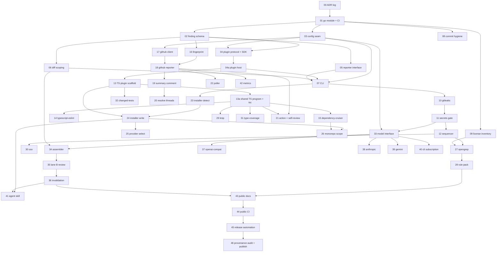

# Automated Code Review System — PR-level Implementation Plan

Executes the architect's build plan end to end. Unit of planning is the individual pull request.
Core in Go; TypeScript analysis reached through the plugin protocol (Appendix A, ADR-0002).

## 1. Assumptions

- **Core in Go**, module `github.com/adamtait/reviewer`, `go 1.25` toolchain directive, built on
  current stable. Stdlib-first: `go test` with golden files under `testdata/` and a `-update` flag,
  `go vet` + `staticcheck` in CI, hand-rolled subcommand dispatch over `flag` rather than a CLI
  framework — a small dependency tree is one of the reasons this language was chosen and
  `THIRD_PARTY_LICENSES.md` is the place it shows.
- **Plugin protocol:** newline-delimited JSON over stdio with a versioned handshake. One plugin
  process may serve many analyzers, and stays warm for the whole run. `pkg/plugin` is the Go SDK and,
  with `schema/plugin-protocol.schema.json`, the only stable public API surface.
- **TypeScript analysis is a plugin**, `@adamtait/reviewer-plugin-typescript`, living in
  `plugins/typescript/` in this repo and published to npm. It hosts `tsc`, typescript-eslint,
  dependency-cruiser, Knip, type-coverage and the changed-tests runner in one process over one shared
  TypeScript program, and resolves `typescript`/`eslint` from the destination repo because `init`
  installs it there as a devDependency.
- **Decisions are recorded as ADRs** in `docs/adr/NNNN-slug.md`, MADR-lite, append-only: an Accepted
  ADR is never edited, only superseded. Each lands in the PR that first implements its decision
  (PR-00 for the ones antecedent to any code). ADR markdown is excluded from a PR's diff budget, like
  golden files and testdata, and quoted separately. Register: Appendix B.
- **Repo is 100% public-core.** It never contains org names, endpoint URLs, `AGENTS.md` content, or
  real rule patterns. Internal detail lives in the *destination* repo under `.review/`, written at
  install time.
- **Install path:** `reviewer init` detects the destination repo, writes `.review/config.yaml`,
  `.review/rules/`, `.github/workflows/review.yml`, `.agent/skills/code-review/`, and adds the
  TypeScript plugin to its devDependencies. Idempotent; refuses overwrite without `--force`.
- **Naming and license:** binary `reviewer`; MIT, personal copyright. MIT needs no `NOTICE`; SPDX
  headers on every `.go` and `.ts` file, enforced by `addlicense` in CI.
- **Six model access paths**, chosen at install: `openai-compatible`, `openai`, `gemini`, `anthropic`,
  `claude-code` and `codex` (subscription CLIs, spawned). Secrets from env; provider choice from config.
- **Exit code is always 0** except CLI misuse (2). The advisory posture lives in the process contract,
  not in workflow YAML.
- **Third-party CLI tools** (gitleaks, opengrep, osv-scanner) are never linked or vendored: resolved
  from `PATH`, version-pinned in config, spawned.

## 2. Deviations from PLAN §9

| Deviation | Reason |
|---|---|
| Core implemented in Go, not the Node/TypeScript stack PLAN's `npx @team/review` implies | Owner's decision (Appendix A). PLAN §8.1's invocation shape changes; nothing in §1–§7 does. |
| All analyzers, first-party included, reach the core through one plugin protocol | Requested. Makes §3's tool list a set of plugins rather than a set of imports, and makes non-TypeScript target languages additive. |
| PR-04 split into PR-04 (wire protocol + SDK) and PR-04a (host lifecycle) | The protocol is now load-bearing, not a convenience; the contract and the process lifecycle are two separate judgements. |
| PR-13 is the TypeScript plugin scaffold; PR-13a merges the shared TS program with its first consumer (`tsc`) | A program cache with no consumer cannot be reviewed on its merits; `tsc` is its simplest one. |
| PR-00 (ADR log) added ahead of PR-01 | Decisions must be recorded with the code that implements them; the format and the append-only rule have to exist before the first ADR does. |
| 27 ADRs distributed across 21 existing PRs rather than one docs PR | An ADR written after the fact records a rationalisation, not a decision. |
| New Milestone 3 (installer, PR-23–26), absent from §9 | Adaptation to a destination repo is the product's front door and what keeps internal config out of this repo. |
| Both PR triggers built (PR-21 Action, PR-22 poller), not Action-with-fallback | Removes §10.2 from the critical path entirely. |
| Four provider-adapter PRs (37–40) replace §5's single OpenAI-compatible client | Six access paths requested; `openai-compatible` preserves §5's `baseURL`+`apiKey` shape as one sibling. |
| Commit hygiene + license inventory land in M0 (PR-08, PR-09), not a publication phase | Open-sourceability must be structural from the first PR. |
| Opengrep (PR-27) precedes Knip/OSV/type-coverage/changed-tests within phase 2 | Conventions-as-rules is §4's stated product; the other four are additive. |
| Secrets gate is PR-11, ordered before any `ModelProvider` type exists (PR-33) | §6 says week one; expressed as a topological guarantee rather than a calendar one. |
| Monorepo scoping (PR-26) sits in the installer, not phase 2 | Detection is an install-time concern; keeps the §10.6 unknown off the engine's critical path. |
| Self-review (PR-21) runs the TypeScript plugin against `plugins/typescript/src/` | The Go core cannot dogfood the TypeScript analyzers; the plugin is itself TypeScript, so it can. |

**Conflicts named and resolved:** §1 ("model access injected via env, OpenAI-compatible") vs. the
six-provider requirement → multi-adapter port wins; env carries secrets only. §8.1 (`npx
@team/review` under a Google org) vs. "personal project, MIT, Go core" → the latter wins; the Action
installs a released binary and `@team` naming is dropped.

## 3. Repository layout

```
reviewer/                                   [public-core]  MIT; no internal data, ever
├── LICENSE  README.md  CONTRIBUTING.md  SECURITY.md  CHANGELOG.md   [public-core]
├── THIRD_PARTY_LICENSES.md                 [public-core]  Go modules + plugin npm deps, CI-checked
├── go.mod  go.sum  .goreleaser.yaml  .gitleaks.toml
├── action.yml                              [public-core]  composite Action; installs the binary
├── .github/workflows/{ci.yml,self-review.yml,release.yml}           [public-core]
├── docs/{architecture.md,plugin-protocol.md,writing-rules.md,providers.md}   [public-core]
├── docs/adr/{README.md,template.md,NNNN-*.md}                      [public-core]  append-only
├── schema/{finding.schema.json,plugin-protocol.schema.json}         [public-core]
├── cmd/reviewer/main.go                    [public-core]
├── pkg/                                    [public-core]  stable API for plugin authors
│   ├── finding/finding.go
│   └── plugin/{plugin.go,protocol.go,serve.go}
├── internal/                               [public-core]
│   ├── config/{schema.go,load.go,resolve.go}           <- the seam
│   ├── pluginhost/{manager.go,handshake.go,frames.go,registry.go}
│   ├── sequencer/sequencer.go
│   ├── analyzers/{gitleaks,opengrep,osv}/              <- native; spawn pinned binaries
│   ├── diff/{scope.go,hunks.go}   gate/secrets.go   fingerprint/fingerprint.go
│   ├── laneb/{assemble.go,review.go,invalidate.go,prompts/*.md}
│   ├── model/{provider.go,fake.go,openaicompat.go,anthropic.go,gemini.go,clisub.go}
│   ├── reporters/{reporter.go,text.go,rdjson.go,github.go,summary.go}
│   ├── ghclient/{client.go,gogithub.go}
│   ├── installer/{detect.go,plan.go,write.go,providers.go,monorepo.go,templates/*}
│   └── poller/poller.go
├── plugins/typescript/                     [public-core]  @adamtait/reviewer-plugin-typescript
│   ├── package.json  tsconfig.json
│   └── src/{serve.ts,program.ts,analyzers/{tsc,eslint,depcruiser,knip,typecov,changedtests}.ts}
├── examples/
│   ├── config.minimal.yaml                 [public-core]  generic values only
│   ├── rules/*.yaml                        [public-core]  generic demo rules only
│   └── plugins/shell-hello/                [public-core]  ~40-line plugin, proves the protocol
├── tools/{checkadrs,checklicenses,audithistory}/main.go             [public-core]
└── testdata/{tiny-ts-repo/,tiny-monorepo/,github-api/,golden/}      [public-core]
```

Generated into the destination repo, never present here — `.review/config.yaml`,
`.review/rules/*.yaml`, `.review/prompts/*.md`, `.review/type-coverage-baseline.json`,
`.github/workflows/review.yml`, `.agent/skills/code-review/` — all **[internal-only]**.

## 4. Milestone overview

| Milestone | PRs | PLAN phase | Demoable outcome | Exit criterion | Blocked by |
|---|---|---|---|---|---|
| M0 Foundation & seam | 00–09 incl. 04a | pre-0 | `reviewer --base main --reporter text` runs; the shell example plugin answers a handshake | CI green; `checkadrs`, `checklicenses`, gitleaks-on-own-history pass | — |
| M1 Lane A deterministic | 10–15 incl. 13a | 0 | Local text review of a real PR finds a true boundary violation and a floating promise | One warm plugin process serves three TS analyzers over one TS program; secrets gate provably blocks lane B | — |
| M2 GitHub surface | 16–22 | 1 | Inline advisory comments on a live PR, no duplicates across force-push | 10 PRs reviewed, zero duplicate comments | Actions availability (PR-21 only) |
| M3 Installer | 23–26 | new | `reviewer init` configures a fresh repo, plugin included, end to end | Fixture repo goes from clean to reviewing in one command | Nx answer (PR-26 only) |
| M4 Rules & full lane A | 27–32 | 2 | Three real team conventions fire automatically | Three most-repeated review comments now automated | — |
| M5 Lane B | 33–40 | 3 | Collapsed summary comment with evidence-bearing findings | Summary read, not collapsed-and-ignored; ≥1 provider live | Model terms (PR-37 enablement) |
| M6 Skill & measurement | 41–42 | 4–5 | Agent invokes review pre-PR; weekly acceptance table by `ruleId` | One rule deleted on evidence | M5 |
| M7 Publication | 43–46 | new | Public repo; `v0.1.0` binaries on Releases and the plugin on npm | `go install` and `npm i` both work from a clean machine | Provenance audit (PR-46) |

## 5. PR sequence

### M0 — Foundation & OSS seam

Everything that decides whether publishing is a copy or a rewrite lands here, before any behavior.

### PR-00 — Establish the ADR log and its append-only check

**Delivers:** `docs/adr/` with the process, template, index, an enforcement tool, and the three decisions antecedent to any code; records ADR-0000, ADR-0001, ADR-0002.
**Depends on:** none.
**Touches:** `docs/adr/{README.md,template.md}`, `docs/adr/{0000-record-architecture-decisions,0001-license-mit-with-spdx-headers,0002-go-core-typescript-plugin}.md`, `tools/checkadrs/main.go`.
**Diff budget:** ~140 lines of tool and index, plus 3 ADRs (~140 lines, not counted).
**OSS class:** public-core — the decision record is the first thing a public contributor reads and must carry no internal detail.
**Reviewer's question:** is this the decision-record format, and is "supersede, never edit" the right immutability rule?
**Proof:** `go run ./tools/checkadrs` → `3 ADRs, index in sync, 0 violations`; edit an Accepted ADR's Decision section and rerun → `ADR-0001: accepted ADR modified outside its status block`.
**Exit criterion:** the check fails on a duplicate number, a missing index entry, an invalid status, a one-way supersession link, and an edit to an Accepted ADR's body.
**Risk / rollback:** docs plus one tool. **Paired with PR-01, which wires the check into CI — revert PR-01 first.**

### PR-01 — Bootstrap the Go module, MIT license, and CI

**Delivers:** `go.mod`, package skeleton, `go vet` + `staticcheck` + `go test` + `addlicense` + PR-00's ADR check in `ci.yml`, MIT `LICENSE`; records ADR-0026.
**Depends on:** PR-00.
**Touches:** `go.mod`, `.gitignore`, `LICENSE`, `.github/workflows/ci.yml`, `cmd/reviewer/main.go`, `docs/adr/0026-two-release-artifacts.md`.
**Diff budget:** ~260 lines, plus 1 ADR (~45 lines, not counted).
**OSS class:** public-core — fixes the module path, the two-artifact release shape, and header enforcement at the first commit.
**Reviewer's question:** is this the right module path, toolchain floor, and license posture to build 48 more PRs on?
**Proof:** `go build ./... && go vet ./... && staticcheck ./... && go test ./...` → all pass; `addlicense -check .` → clean.
**Exit criterion:** CI green; a `.go` file without an SPDX header fails the build.
**Risk / rollback:** revert deletes the scaffolding; nothing depends on it yet but PR-00's CI wiring.

### PR-02 — Add the Finding type and its JSON Schema

**Delivers:** `Finding` per PLAN §2 as a Go struct with validation, `schema/finding.schema.json` generated from it for plugin authors, and a golden serialization test; records ADR-0003.
**Depends on:** PR-01.
**Touches:** `pkg/finding/finding.go`, `pkg/finding/finding_test.go`, `schema/finding.schema.json`, `testdata/golden/findings.json`, `docs/adr/0003-one-findings-schema.md`.
**Diff budget:** ~220 lines, plus 1 ADR (~45 lines, not counted).
**OSS class:** public-core — the contract every plugin author and every reporter codes against.
**Reviewer's question:** is this shape sufficient for both lanes and all three reporters, and is `Evidence` correctly required when `Lane == LaneLLM`?
**Proof:** `go test ./pkg/finding/...` → golden file matches; a lane-B finding without evidence fails validation; `go run ./tools/genschema && git diff --exit-code schema/` → no drift.
**Exit criterion:** validation rejects all six malformed cases in the table test.
**Risk / rollback:** revert is free; nothing imports it yet.

### PR-03 — Add config schema and resolution (the internal/public seam)

**Delivers:** `Config` types, `.review/config.yaml` loader, env overlay, and `Resolve()` — the only channel through which repo-specific values reach the core; records ADR-0004.
**Depends on:** PR-01.
**Touches:** `internal/config/{schema.go,load.go,resolve.go,resolve_test.go}`, `examples/config.minimal.yaml`, `docs/adr/0004-repo-specific-values-behind-config.md`.
**Diff budget:** ~340 lines, plus 1 ADR (~45 lines, not counted).
**OSS class:** public-core — the mechanism that keeps endpoints, org names, and rule paths out of the core from PR-03 onward.
**Reviewer's question:** can any repo-specific value reach the core except through `Config`?
**Proof:** `go test ./internal/config/...` → `examples/config.minimal.yaml` resolves fully defaulted; an unknown key fails with a path-qualified error.
**Exit criterion:** a test greps the built package for `http` URL literals and finds none outside testdata.
**Risk / rollback:** self-contained.

### PR-04 — Define the plugin protocol and the Go plugin SDK

**Delivers:** protocol v1 — newline-delimited JSON frames over stdio, `hello`/`describe`/`analyze`/`bye`, an analyzer descriptor carrying `id`, `lane` and `order`; `pkg/plugin` SDK; JSON Schema; a ~40-line shell example plugin; records ADR-0005, ADR-0006, ADR-0025.
**Depends on:** PR-02, PR-03.
**Touches:** `pkg/plugin/{plugin.go,protocol.go,serve.go,protocol_test.go}`, `schema/plugin-protocol.schema.json`, `examples/plugins/shell-hello/`, `docs/plugin-protocol.md`, `docs/adr/{0005-two-lane-analysis,0006-all-analyzers-are-plugins,0025-ndjson-over-stdio}.md`.
**Diff budget:** ~390 lines, plus 3 ADRs (~140 lines, not counted).
**OSS class:** public-core — the extension seam, and the only API this project promises not to break.
**Reviewer's question:** is this the wire contract to be stuck with, and can a plugin in any language satisfy it without importing Go?
**Proof:** `go test ./pkg/plugin/...` → round-trips every frame against the schema; `bash examples/plugins/shell-hello/plugin.sh <<< '{"t":"hello","v":1}'` → a valid `hello` reply and one `Finding`.
**Exit criterion:** a plugin declaring an unknown protocol version is refused with a typed error, not a panic.
**Risk / rollback:** independent; no host exists to speak it yet.

### PR-04a — Add the plugin host manager

**Delivers:** discovery from config, spawn, handshake and version negotiation, descriptor registry, graceful `bye` then process-group kill, stderr captured to the run log.
**Depends on:** PR-04.
**Touches:** `internal/pluginhost/{manager.go,handshake.go,frames.go,registry.go,manager_test.go}`.
**Diff budget:** ~360 lines.
**OSS class:** public-core.
**Reviewer's question:** is a plugin that hangs, crashes mid-frame, or writes garbage to stdout contained without taking the run down?
**Proof:** `go test ./internal/pluginhost/...` → four fault-injection cases (no handshake, bad version, mid-frame exit, 10s hang) each yield zero findings, one warning, and no leaked process.
**Exit criterion:** `pgrep -P` after every test case finds no surviving child.
**Risk / rollback:** revert leaves the protocol unusable; PR-05+ unaffected.

### PR-05 — Define the Reporter interface with text and rdjson reporters

**Delivers:** `Reporter` interface plus human-readable `text` and Reviewdog `rdjson`.
**Depends on:** PR-02.
**Touches:** `internal/reporters/{reporter.go,text.go,rdjson.go,reporters_test.go}`, `testdata/golden/{text.txt,rdjson.json}`.
**Diff budget:** ~280 lines.
**OSS class:** public-core.
**Reviewer's question:** does the interface carry enough context for a stateful reporter (GitHub) to be added later without widening it?
**Proof:** `go test ./internal/reporters/...` → both golden files match for the same 4-finding input.
**Exit criterion:** `rdjson` output validates against the Reviewdog diagnostic schema in testdata.
**Risk / rollback:** independent.

### PR-06 — Add diff scoping and the tiny-ts-repo fixture

**Delivers:** changed-file and changed-line extraction from `git diff --merge-base`, `FilterToChangedLines()`, and the primary fixture repo; records ADR-0007.
**Depends on:** PR-02.
**Touches:** `internal/diff/{scope.go,hunks.go,hunks_test.go}`, `testdata/tiny-ts-repo/**`, `docs/adr/0007-scope-analysis-to-changed-lines.md`.
**Diff budget:** ~320 lines excluding fixture, plus 1 ADR (~45 lines, not counted).
**OSS class:** public-core.
**Reviewer's question:** is hunk parsing correct for renames, deletions, and binary files?
**Proof:** `go test ./internal/diff/...` → the fixture's two-commit history yields exactly 3 changed files and 11 changed lines; a finding on an untouched line is filtered out.
**Exit criterion:** rename-with-edit asserted.
**Risk / rollback:** independent; revert makes every analyzer whole-repo, which is why nothing ships before it.

### PR-07 — Wire the CLI entrypoint

**Delivers:** `reviewer` with `--base`, `--reporter`, `--staged`, `--pr`, `--config`, `--only`, `--skip`; loads config, starts zero plugins, prints via reporter, exits 0; records ADR-0008, ADR-0009.
**Depends on:** PR-03, PR-04a, PR-05, PR-06.
**Touches:** `cmd/reviewer/{main.go,run.go,flags.go,flags_test.go}`, `docs/adr/{0008-cli-not-service,0009-never-block-a-pull-request}.md`.
**Diff budget:** ~310 lines, plus 2 ADRs (~90 lines, not counted).
**OSS class:** public-core.
**Reviewer's question:** is the flag surface and the always-exit-0 advisory contract right?
**Proof:** `go build -o /tmp/reviewer ./cmd/reviewer && (cd testdata/tiny-ts-repo && /tmp/reviewer --base main --reporter text; echo $?)` → `reviewer: 0 plugins, 0 analyzers, 0 findings` then `0`.
**Exit criterion:** invalid flag exits 2 with usage; every other path exits 0.
**Risk / rollback:** revert removes the only entrypoint; M1 depends on it.

### PR-08 — Gate this repo's own history against secrets

**Delivers:** `.gitleaks.toml`, a pre-commit hook installed by `make hooks`, and a CI job scanning full history; records ADR-0010.
**Depends on:** PR-01.
**Touches:** `.gitleaks.toml`, `Makefile`, `.github/workflows/ci.yml`, `docs/adr/0010-keep-internal-data-out-of-history.md`.
**Diff budget:** ~110 lines, plus 1 ADR (~45 lines, not counted).
**OSS class:** public-core — what must never enter history: API keys, internal hostnames, `.review/` files from any real repo, `AGENTS.md` copies.
**Reviewer's question:** does the allowlist admit the fixture's deliberate fake secret without admitting real ones?
**Proof:** `gitleaks detect --source . --config .gitleaks.toml --log-opts=--all` → `no leaks found`; a commit containing `sk-ant-` is rejected locally.
**Exit criterion:** CI fails on a branch adding a synthetic AWS key outside the fixture allowlist.
**Risk / rollback:** revert removes the guard only.

### PR-09 — Add the third-party license inventory and its check

**Delivers:** `THIRD_PARTY_LICENSES.md`, `tools/checklicenses` reconciling it against `go list -m -json all` **and** the plugin's `npm ls --json`, a CI job, and a denylist failing on any copyleft dependency on either side; records ADR-0011.
**Depends on:** PR-01.
**Touches:** `THIRD_PARTY_LICENSES.md`, `tools/checklicenses/main.go`, `.github/workflows/ci.yml`, `docs/adr/0011-opengrep-as-separate-process.md`.
**Diff budget:** ~240 lines, plus 1 ADR (~45 lines, not counted).
**OSS class:** public-core — where the Opengrep LGPL-2.1 boundary is *enforced*, before the analyzer exists (PR-27): Opengrep is listed as an external binary, and no copyleft module or npm package may appear as a dependency.
**Reviewer's question:** does the denylist make an accidental copyleft dependency a CI failure rather than a legal review?
**Proof:** `go run ./tools/checklicenses` → `Go: N modules, npm: M packages, 0 copyleft, inventory in sync`; adding a GPL module fails it.
**Exit criterion:** drift in either direction, on either side, fails CI.
**Risk / rollback:** revert removes the check.

### M1 — Lane A deterministic

The secrets gate lands before any type named `ModelProvider` exists. The TypeScript plugin arrives as
a scaffold first, so the cross-language protocol is proven before six analyzers depend on it.

### PR-10 — Add the gitleaks analyzer

**Delivers:** native Go analyzer spawning the pinned gitleaks binary against changed files, parsing its JSON report into `secrets/*` findings at `high`/`error`.
**Depends on:** PR-07.
**Touches:** `internal/analyzers/gitleaks/{gitleaks.go,gitleaks_test.go}`, `cmd/reviewer/run.go` (register), `testdata/golden/gitleaks.json`.
**Diff budget:** ~220 lines.
**OSS class:** public-core.
**Reviewer's question:** is spawning the pinned binary right rather than importing gitleaks as a Go module, given PR-11 depends on knowing whether the scan ran?
**Proof:** `(cd testdata/tiny-ts-repo && /tmp/reviewer --base main --reporter text)` → one finding, `secrets/generic-api-key src/config.ts:4`.
**Exit criterion:** binary absent → exit 0, one warning, `SecretsScanUnavailable` set on the run context.
**Risk / rollback:** revert leaves PR-11's gate with nothing to trigger on — revert both.

### PR-11 — Add the secrets gate that blocks lane B

**Delivers:** any `secrets/*` finding, or `SecretsScanUnavailable`, sets `LaneBBlocked` and hard-skips every analyzer whose descriptor declares `lane: llm`; records ADR-0012.
**Depends on:** PR-10.
**Touches:** `internal/gate/{secrets.go,secrets_test.go}`, `internal/pluginhost/registry.go`, `docs/adr/0012-abort-llm-lane-on-secret-detection.md`.
**Diff budget:** ~170 lines, plus 1 ADR (~45 lines, not counted).
**OSS class:** public-core — PLAN §6's one non-obvious safety property.
**Reviewer's question:** is it structurally impossible for a lane-B analyzer to be invoked when the gate is set, including one supplied by a third-party plugin?
**Proof:** `go test ./internal/gate/...` → a spy plugin declaring `lane: llm` receives zero `analyze` frames on the fixture, and one when the fake secret is removed.
**Exit criterion:** fails closed when the scanner could not run at all.
**Risk / rollback:** **paired with PR-10** — reverting either alone breaks the invariant.

### PR-12 — Add the sequencer with per-analyzer timeout and fail-open

**Delivers:** ordered execution per PLAN §3 across plugins, per-analyzer `context` timeout, fail-open with a warning, `--only`/`--skip`, per-analyzer timing in `text` output; records ADR-0013.
**Depends on:** PR-11.
**Touches:** `internal/sequencer/{sequencer.go,sequencer_test.go}`, `internal/config/schema.go`, `docs/adr/0013-fixed-analyzer-order-fail-open.md`.
**Diff budget:** ~290 lines, plus 1 ADR (~45 lines, not counted).
**OSS class:** public-core.
**Reviewer's question:** is fail-open correct for every analyzer *except* the secrets scanner, and does ordering across plugins match §3 when one plugin owns six analyzers?
**Proof:** `/tmp/reviewer --base main --reporter text --skip tsc` → analyzers listed in §3 order with ms timings, `tsc skipped`.
**Exit criterion:** an analyzer exceeding its timeout is killed with its process group and the run completes.
**Risk / rollback:** revert restores unordered execution; analyzers still work.

### PR-13 — Add the TypeScript plugin scaffold

**Delivers:** `@adamtait/reviewer-plugin-typescript` — `serve.ts` speaking protocol v1, a `describe` reply advertising zero analyzers, and its own build and test setup. No analysis yet.
**Depends on:** PR-04a.
**Touches:** `plugins/typescript/{package.json,tsconfig.json,src/serve.ts,src/serve.test.ts}`, `.github/workflows/ci.yml` (plugin leg), `docs/plugin-protocol.md`.
**Diff budget:** ~280 lines.
**OSS class:** public-core.
**Reviewer's question:** does the protocol hold across a language boundary, and is one long-lived process per plugin the right lifecycle?
**Proof:** `npm --prefix plugins/typescript ci && npm --prefix plugins/typescript test` → passes; `/tmp/reviewer --base main --reporter text` in the fixture → `1 plugin (typescript v0.1.0, protocol 1), 0 analyzers`.
**Exit criterion:** the host completes a full handshake and clean shutdown against the real plugin, not a stub.
**Risk / rollback:** revert removes the plugin; the core and native analyzers are unaffected.

### PR-13a — Share one TypeScript program inside the plugin, with tsc as its first consumer

**Delivers:** `program.ts` building one TypeScript program per `tsconfig` per run, memoized for the process lifetime, plus the `tsc` analyzer consuming it and diff-scoping its diagnostics; records ADR-0014.
**Depends on:** PR-13.
**Touches:** `plugins/typescript/src/{program.ts,analyzers/tsc.ts}`, `plugins/typescript/src/program.test.ts`, `docs/adr/0014-one-warm-plugin-one-ts-program.md`.
**Diff budget:** ~330 lines, plus 1 ADR (~45 lines, not counted).
**OSS class:** public-core — the mitigation that makes a Go core affordable (Appendix A).
**Reviewer's question:** is one program per `tsconfig`, held for the process lifetime, correct for a repo with project references or several workspaces?
**Proof:** fixture with an injected type error → `types/TS2322 src/domain/order.ts:12`; `REVIEWER_TRACE=1` with three TS analyzers registered logs exactly one `createProgram` per tsconfig.
**Exit criterion:** cache keyed on resolved tsconfig path plus file-set hash; never reused across runs.
**Risk / rollback:** revert leaves no TS analyzer; PR-14/15 depend on it.

### PR-14 — Add the type-aware typescript-eslint analyzer to the plugin

**Delivers:** ESLint run with the destination repo's flat config, restricted to the §3 rule set, reusing PR-13a's program, diff-scoped.
**Depends on:** PR-13a.
**Touches:** `plugins/typescript/src/analyzers/eslint.ts`, `plugins/typescript/src/analyzers/eslint.test.ts`, `docs/architecture.md`.
**Diff budget:** ~300 lines.
**OSS class:** public-core.
**Reviewer's question:** is using the repo's own ESLint config right rather than shipping ours, and is cold-start acceptable with the shared program?
**Proof:** fixture → `logic/no-floating-promises src/infra/http.ts:9`; `--only eslint` prints elapsed ms for the runtime-budget conversation.
**Exit criterion:** repo with no ESLint config → analyzer reports itself unavailable in `describe`, exit 0.
**Risk / rollback:** additive; PLAN §10.5 is a runtime risk, not a correctness one — see §9.

### PR-15 — Add the dependency-cruiser analyzer to the plugin

**Delivers:** programmatic dependency-cruiser run using the destination repo's `.dependency-cruiser.js`, mapped to `arch/*` rule IDs.
**Depends on:** PR-13a.
**Touches:** `plugins/typescript/src/analyzers/depcruiser.ts`, `plugins/typescript/src/analyzers/depcruiser.test.ts`, `testdata/tiny-ts-repo/.dependency-cruiser.js`.
**Diff budget:** ~250 lines.
**OSS class:** public-core.
**Reviewer's question:** are cycles and orphans reported at a file and line that can carry an inline comment?
**Proof:** fixture → `arch/no-domain-to-infra src/domain/order.ts:3` with the forbidden import on the reported line.
**Exit criterion:** whole-repo violations on untouched files are filtered out.
**Risk / rollback:** additive. **M1 exit: PLAN phase 0 satisfied.**

### M2 — GitHub surface

Dedupe exists before the first comment is ever posted.

### PR-16 — Add fingerprinting

**Delivers:** `sha256(ruleID + path + normalizedSnippet)`, a snippet normalizer (whitespace, quotes, trailing commas), and the 6-hex short form used in comment markers; records ADR-0015.
**Depends on:** PR-02.
**Touches:** `internal/fingerprint/{fingerprint.go,fingerprint_test.go}`, `docs/adr/0015-fingerprint-by-normalized-snippet.md`.
**Diff budget:** ~180 lines, plus 1 ADR (~45 lines, not counted).
**OSS class:** public-core.
**Reviewer's question:** does the fingerprint survive a line shift and a reindent but change when the logic changes?
**Proof:** `go test ./internal/fingerprint/...` → identical for the same snippet at lines 10 and 40; differs when an operator changes.
**Exit criterion:** three invariance cases and two sensitivity cases asserted.
**Risk / rollback:** independent.

### PR-17 — Add the GitHub client and a read-only go-github adapter

**Delivers:** a `Client` interface plus a `go-github` implementation for `ListReviewComments`, `GetPullRequest`, `ListFiles`. No writes.
**Depends on:** PR-03.
**Touches:** `internal/ghclient/{client.go,gogithub.go,gogithub_test.go}`, `testdata/github-api/*.json`, `THIRD_PARTY_LICENSES.md`.
**Diff budget:** ~290 lines.
**OSS class:** public-core.
**Reviewer's question:** is the interface narrow enough that a reviewer can see exactly which token scopes are needed?
**Proof:** `go test ./internal/ghclient/...` → recorded fixtures replay through an `httptest` server; pagination over 2 pages asserted.
**Exit criterion:** no write method exists on the interface at this PR.
**Risk / rollback:** independent; read-only by construction.

### PR-18 — Add the GitHub reporter with fingerprint dedupe

**Delivers:** inline review comments for `high` confidence only, `<!-- rv:xxxxxx -->` markers, fingerprints already present skipped, `--dry-run` printing the payload instead of posting; records ADR-0016, ADR-0017.
**Depends on:** PR-16, PR-17.
**Touches:** `internal/reporters/github.go`, `internal/ghclient/{client.go,gogithub.go}` (add `CreateReviewComment`), `cmd/reviewer/flags.go`, `internal/reporters/github_test.go`, `docs/adr/{0016-github-comments-as-the-store,0017-presentation-gated-on-confidence}.md`.
**Diff budget:** ~440 lines. *Over budget: the write path, the dedupe query, and the dry-run switch are one behavior — splitting ships a reporter that posts duplicates.* Plus 2 ADRs (~90 lines).
**OSS class:** public-core.
**Reviewer's question:** is it impossible to post a duplicate, and impossible to post at all without `--reporter github`?
**Proof:** `/tmp/reviewer --pr 1 --reporter github --dry-run` → 2 comment bodies with markers; run twice against a real PR → second run reports `2 findings, 0 posted (deduped)`.
**Exit criterion:** `medium`/`low` findings are never posted inline.
**Risk / rollback:** worst case is noisy comments on one PR; revert stops posting and leaves lane A intact.

### PR-19 — Add the collapsed summary comment

**Delivers:** one sticky `<details>` comment carrying all `medium`/`low` findings, upserted by a `<!-- rv:summary -->` marker.
**Depends on:** PR-18.
**Touches:** `internal/reporters/summary.go`, `internal/ghclient/gogithub.go` (issue-comment upsert), `internal/reporters/summary_test.go`.
**Diff budget:** ~290 lines.
**OSS class:** public-core.
**Reviewer's question:** is the summary grouped and short enough that a human expands it?
**Proof:** `--reporter github --dry-run` with 9 findings → one body grouped by `ruleId`, collapsed; second run updates rather than appends.
**Exit criterion:** exactly one summary comment per PR regardless of run count.
**Risk / rollback:** additive to PR-18.

### PR-20 — Resolve stale threads behind an opt-in config flag

**Delivers:** GraphQL `resolveReviewThread` for fingerprints absent from the current run; default `resolveStaleThreads: false`.
**Depends on:** PR-19.
**Touches:** `internal/reporters/github.go`, `internal/ghclient/gogithub.go`, `internal/config/schema.go`, `internal/reporters/resolve_test.go`.
**Diff budget:** ~240 lines.
**OSS class:** public-core.
**Reviewer's question:** is opt-in the right default given this is the only action the bot takes on a human's thread?
**Proof:** `--dry-run` with the flag on → `would resolve thread rv:a3f9c2`; off → `0 resolutions`.
**Exit criterion:** only threads authored by the token's own identity are ever resolved.
**Risk / rollback:** flag off restores prior behavior with no code change.

### PR-21 — Add the composite action and self-review workflow

**Delivers:** `action.yml` (binary download by pinned version and checksum, plugin install, `reviewer` invocation) and `self-review.yml` running the native analyzers on the whole repo **and** the TypeScript plugin against `plugins/typescript/src/`; records ADR-0018.
**Depends on:** PR-18, PR-13a.
**Touches:** `action.yml`, `.github/workflows/self-review.yml`, `docs/architecture.md`, `docs/adr/0018-pull-request-trigger-not-target.md`.
**Diff budget:** ~200 lines, plus 1 ADR (~45 lines, not counted).
**OSS class:** public-core — consumers reference `adamtait/reviewer@v0`; no secrets in the action.
**Reviewer's question:** are permissions minimal (`contents: read`, `pull-requests: write`), is `pull_request` used rather than `pull_request_target`, and is the binary checksum-pinned?
**Proof:** open a PR here → the self-review job posts a lane A summary; a PR touching `plugins/typescript/src/` also gets typescript-eslint findings; a fork PR runs lane A and skips lane B.
**Exit criterion:** workflow green; no `pull_request_target` anywhere in the tree.
**Risk / rollback:** delete the workflow; the action stays for consumers.

### PR-22 — Add the local poller surface

**Delivers:** `reviewer watch` — polls `ListPullRequests` on an interval, invokes the review path with `--pr <n> --reporter github`, plus a `launchd` plist template; records ADR-0019.
**Depends on:** PR-18.
**Touches:** `internal/poller/{poller.go,poller_test.go}`, `cmd/reviewer/watch.go`, `internal/installer/templates/launchd.plist.tmpl`, `docs/architecture.md`, `docs/adr/0019-ship-action-and-local-poller.md`.
**Diff budget:** ~320 lines, plus 1 ADR (~45 lines, not counted).
**OSS class:** public-core.
**Reviewer's question:** does the poller avoid re-reviewing unchanged PRs (an `updatedAt` watermark persisted to disk)?
**Proof:** `/tmp/reviewer watch --once --repo adamtait/reviewer --dry-run` → candidate PRs and the review calls it would make; a second `--once` with no new pushes makes zero.
**Exit criterion:** watermark survives process restart.
**Risk / rollback:** independent surface. **M2 exit: PLAN phase 1 satisfied.**

### M3 — Installer

The milestone that makes "no internal data in this repo" a mechanism rather than a promise.

### PR-23 — Add the installer with destination detection

**Delivers:** `reviewer init --dry-run`: detects package manager, workspaces/Nx, test runner, tsconfig layout, existing ESLint and dependency-cruiser config; prints an `InstallPlan`. Writes nothing; records ADR-0020.
**Depends on:** PR-07.
**Touches:** `internal/installer/{detect.go,plan.go,detect_test.go}`, `cmd/reviewer/init.go`, `testdata/tiny-monorepo/**`, `docs/adr/0020-adapt-at-install-time.md`.
**Diff budget:** ~380 lines, plus 1 ADR (~45 lines, not counted).
**OSS class:** dual — the installer is public; the plan it prints describes destination-internal files.
**Reviewer's question:** is `InstallPlan` the complete set of decisions install must make?
**Proof:** `(cd testdata/tiny-monorepo && /tmp/reviewer init --dry-run)` → 2 workspaces, `vitest`, 5 files to create, 1 devDependency to add, 0 overwrites.
**Exit criterion:** `--dry-run` creates zero files, asserted by `git status --porcelain` in the test.
**Risk / rollback:** read-only.

### PR-24 — Add installer writers, including the TypeScript plugin devDependency

**Delivers:** templated `.review/config.yaml`, `.review/rules/.gitkeep`, `.github/workflows/review.yml`, and `@adamtait/reviewer-plugin-typescript` added to the destination's devDependencies at the version matching the binary; idempotent; `--force` to overwrite.
**Depends on:** PR-23, PR-13.
**Touches:** `internal/installer/{write.go,write_test.go}`, `internal/installer/templates/{config.yaml.tmpl,review.yml.tmpl}`.
**Diff budget:** ~450 lines including templates. *Over budget: the templates are the deliverable; splitting writer from template ships a writer with nothing to write.*
**OSS class:** dual — templates public and generic; rendered output internal-only and outside this repo.
**Reviewer's question:** does the generated config contain only values detected from the destination repo, and is pinning the plugin to the binary's version the right coupling?
**Proof:** `cp -r testdata/tiny-monorepo /tmp/dest && (cd /tmp/dest && /tmp/reviewer init)` → 4 files created, `package.json` gains one devDependency; rerun → `0 created, 4 unchanged`.
**Exit criterion:** second `init` is a no-op; a plugin/binary version mismatch is reported as a warning at run time.
**Risk / rollback:** revert leaves `--dry-run` working; generated files are plain git-tracked files.

### PR-25 — Add provider selection to the installer

**Delivers:** interactive choice among the six access paths; writes the provider block and `.env.example` naming required variables. Never writes a secret.
**Depends on:** PR-24.
**Touches:** `internal/installer/{providers.go,providers_test.go}`, `internal/installer/templates/config.yaml.tmpl`, `docs/providers.md`.
**Diff budget:** ~300 lines.
**OSS class:** public-core — provider *kinds* are generic; chosen endpoints land only in the destination repo.
**Reviewer's question:** is it impossible for `init` to persist a credential to disk?
**Proof:** `/tmp/reviewer init --provider gemini --yes` in `/tmp/dest` → `provider: gemini`, `.env.example` names the key variable, and a grep for key prefixes under `/tmp/dest/.review` finds nothing.
**Exit criterion:** `laneB.enabled: false` in every generated config regardless of provider — flipped by hand.
**Risk / rollback:** revert falls back to a config with no provider block; lane B stays off either way.

### PR-26 — Add monorepo scoping to the installer

**Delivers:** Nx and npm/pnpm/yarn workspace detection writing `projects:` and an affected-project command into the generated config; the core narrows diff scope accordingly and passes the project list to plugins in the `analyze` frame.
**Depends on:** PR-24, PR-15.
**Touches:** `internal/installer/{monorepo.go,monorepo_test.go}`, `internal/diff/scope.go`, `internal/config/schema.go`, `pkg/plugin/protocol.go` (projects field).
**Diff budget:** ~330 lines.
**OSS class:** dual.
**Reviewer's question:** does a single-package repo behave exactly as it did before this PR?
**Proof:** `init --dry-run` in `tiny-monorepo` → `projects: [pkg-a, pkg-b]`; a PR touching only `pkg-a` runs analyzers against `pkg-a` only.
**Exit criterion:** non-monorepo fixture output byte-identical to PR-24's; the protocol change is additive and old plugins still handshake.
**Risk / rollback:** revert returns to whole-repo-with-diff-filter, correct but slower. **Blocked on the Nx answer (§8).**

### M4 — Rules and the remaining lane A

PLAN §4's claim — conventions are patterns, not prompts — becomes executable here.

### PR-27 — Add the Opengrep analyzer as a spawned binary

**Delivers:** native Go analyzer spawning `opengrep scan --json` with rules from config. No linking, no vendoring, no cgo.
**Depends on:** PR-12, PR-09.
**Touches:** `internal/analyzers/opengrep/{opengrep.go,opengrep_test.go}`, `THIRD_PARTY_LICENSES.md`, `docs/writing-rules.md`.
**Diff budget:** ~230 lines.
**OSS class:** public-core — LGPL-2.1 boundary preserved here, enforced by PR-09's denylist plus a test asserting no Opengrep module or npm entry anywhere.
**Reviewer's question:** is the process boundary the only coupling to Opengrep?
**Proof:** `go test ./internal/analyzers/opengrep/...` → boundary test passes; a fixture with one rule → `conventions/no-raw-fetch-in-domain src/domain/order.ts:5`.
**Exit criterion:** `grep -r opengrep go.mod plugins/typescript/package.json` returns nothing.
**Risk / rollback:** additive; missing binary degrades to a warning.

### PR-28 — Add the rule pack loader, generic example rules, and `rules test`

**Delivers:** `.review/rules/*.yaml` discovery, three generic example rules, and `reviewer rules test` delegating to Opengrep's own rule-test mode.
**Depends on:** PR-27.
**Touches:** `internal/analyzers/opengrep/rules.go`, `cmd/reviewer/rules.go`, `examples/rules/*.yaml`, `docs/writing-rules.md`.
**Diff budget:** ~350 lines.
**OSS class:** public-core — examples are deliberately generic (`no-raw-fetch-in-domain`, `no-console-in-lib`, `no-default-export-in-api`). Real rules encoding internal architecture live only in destination repos.
**Reviewer's question:** is writing a rule a five-minute job with the documented loop?
**Proof:** `/tmp/reviewer rules test --rules examples/rules` → `3 rules, 6 cases, 6 passed`.
**Exit criterion:** every example rule ships a passing positive and negative case.
**Risk / rollback:** revert removes examples and the subcommand; the analyzer still loads rules from config.

### PR-29 — Add the Knip analyzer to the plugin

**Delivers:** unused exports and dependencies, filtered to symbols the PR introduced or touched.
**Depends on:** PR-13a.
**Touches:** `plugins/typescript/src/analyzers/knip.ts`, `plugins/typescript/src/analyzers/knip.test.ts`.
**Diff budget:** ~220 lines.
**OSS class:** public-core.
**Reviewer's question:** is the diff filter tight enough that pre-existing dead code is never reported?
**Proof:** fixture adding an unused export → `dead/unused-export src/domain/order.ts:20`; pre-existing dead code in the same file → not reported.
**Exit criterion:** baseline run on the unchanged fixture yields zero findings.
**Risk / rollback:** additive.

### PR-30 — Add the osv-scanner analyzer

**Delivers:** native Go analyzer spawning `osv-scanner --format json` against the lockfile, reporting only advisories introduced by the PR's lockfile delta.
**Depends on:** PR-12.
**Touches:** `internal/analyzers/osv/{osv.go,osv_test.go}`.
**Diff budget:** ~240 lines.
**OSS class:** public-core.
**Reviewer's question:** is "introduced by this PR" computed from the lockfile diff rather than the whole scan?
**Proof:** fixture PR adding a vulnerable pinned version → one `deps/*` finding; a PR touching no lockfile → zero findings and the scanner never spawned.
**Exit criterion:** unchanged lockfile short-circuits before spawning.
**Risk / rollback:** additive.

### PR-31 — Add the type-coverage ratchet to the plugin

**Delivers:** type-coverage over PR-13a's shared program, compared to `.review/type-coverage-baseline.json`, reporting only a decrease; `reviewer baseline --write` updates it.
**Depends on:** PR-13a.
**Touches:** `plugins/typescript/src/analyzers/typecov.ts`, `plugins/typescript/src/analyzers/typecov.test.ts`, `cmd/reviewer/baseline.go`.
**Diff budget:** ~270 lines.
**OSS class:** public-core; the baseline file is destination-internal.
**Reviewer's question:** is a missing baseline treated as "record, don't report"?
**Proof:** `reviewer baseline --write`, then a PR adding `any` → `types/coverage-regression 98.1% -> 97.4%`; no baseline → zero findings plus a hint.
**Exit criterion:** the ratchet never reports an increase.
**Risk / rollback:** additive.

### PR-32 — Add the changed-tests analyzer to the plugin

**Delivers:** detects `vitest`/`jest` in the destination repo and runs `--changed`/`--onlyChanged`, surfacing failures as findings.
**Depends on:** PR-13.
**Touches:** `plugins/typescript/src/analyzers/changedtests.ts`, `plugins/typescript/src/analyzers/changedtests.test.ts`.
**Diff budget:** ~250 lines.
**OSS class:** public-core.
**Reviewer's question:** is a failing test reported at the assertion's file and line so it can be an inline comment?
**Proof:** fixture with a broken assertion → `tests/failing src/domain/order.test.ts:14` carrying the assertion message.
**Exit criterion:** no test runner detected → analyzer reports itself unavailable in `describe`. **M4 exit: PLAN phase 2 satisfied.**

### M5 — Lane B

The provider interface and the fake provider land before any adapter can make a network call.

### PR-33 — Define the ModelProvider interface with a fake provider and REVIEW_LLM=off

**Delivers:** `Provider` interface (`Complete(ctx, messages, opts) (string, error)`), a deterministic `fake`, and `REVIEW_LLM` defaulting to `off`; records ADR-0021.
**Depends on:** PR-11, PR-03.
**Touches:** `internal/model/{provider.go,fake.go,provider_test.go}`, `internal/config/schema.go`, `docs/adr/0021-six-model-paths-one-provider-interface.md`.
**Diff budget:** ~220 lines, plus 1 ADR (~45 lines, not counted).
**OSS class:** public-core — no endpoint, model name, or org anywhere in the interface.
**Reviewer's question:** does the interface admit both HTTP APIs and subscription CLIs without leaking either into the core?
**Proof:** `go test ./internal/model/...` → the fake satisfies the interface; constructing with `REVIEW_LLM=off` returns `ErrLaneBDisabled`, which the sequencer treats as a skip.
**Exit criterion:** a test asserts the secrets gate short-circuits before any provider is constructed.
**Risk / rollback:** independent; nothing calls out yet.

### PR-34 — Add the lane B context assembler

**Delivers:** a pure function building the model input: diff with N lines of hunk context, lane A findings, config-named guidance files read at HEAD, and a doc-staleness table (`*.md` mtime vs. referenced sources).
**Depends on:** PR-33, PR-06.
**Touches:** `internal/laneb/{assemble.go,assemble_test.go}`, `testdata/golden/assemble.txt`.
**Diff budget:** ~380 lines.
**OSS class:** public-core — guidance file *paths* come from config; no `AGENTS.md` content lives here.
**Reviewer's question:** is the assembled context deterministic and free of anything not named in config?
**Proof:** `go test ./internal/laneb/...` → golden file byte-stable across runs; a repo with no guidance files produces a valid, smaller context.
**Exit criterion:** the golden file contains no absolute paths and no environment values.
**Risk / rollback:** pure function.

### PR-35 — Add the lane B review pass with confidence capping

**Delivers:** prompt templates under `internal/laneb/prompts/` (overridable from `.review/prompts/`), JSON output validated against the findings schema, and a hard cap: `arch/missing-abstraction` and `quality/sloppy` never exceed `medium`; records ADR-0022.
**Depends on:** PR-34.
**Touches:** `internal/laneb/{review.go,review_test.go}`, `internal/laneb/prompts/*.md`, `docs/adr/0022-cap-taste-confidence-in-code.md`.
**Diff budget:** ~390 lines, plus 1 ADR (~45 lines, not counted).
**OSS class:** public-core — shipped prompts are generic; internal phrasing is a destination-repo override.
**Reviewer's question:** is the cap enforced in code rather than requested in the prompt?
**Proof:** `go test ./internal/laneb/...` → the fake returning `high` for a taste category is downgraded to `medium`; malformed JSON yields zero findings and one warning.
**Exit criterion:** taste-category findings can never reach the inline reporter.
**Risk / rollback:** `laneB.enabled: false` disables it without a revert.

### PR-36 — Add the invalidation pass

**Delivers:** a second model call attempting to disprove each candidate; survivors keep `Evidence`, the rest are dropped. `--no-invalidate` for debugging; records ADR-0023.
**Depends on:** PR-35.
**Touches:** `internal/laneb/{invalidate.go,invalidate_test.go}`, `internal/laneb/prompts/invalidate.md`, `cmd/reviewer/flags.go`, `docs/adr/0023-disprove-before-emitting.md`.
**Diff budget:** ~310 lines, plus 1 ADR (~45 lines, not counted).
**OSS class:** public-core.
**Reviewer's question:** is a finding dropped when the disproof is merely plausible, or only when it is specific?
**Proof:** `go test ./internal/laneb/...` → the fake marking 2 of 3 candidates as intended behavior yields 1 finding with evidence; `--no-invalidate` yields 3 without.
**Exit criterion:** every emitted lane B finding has non-empty `Evidence`.
**Risk / rollback:** `--no-invalidate` is the escape hatch; revert drops precision, not function.

### PR-37 — Add the openai-compatible provider adapter

**Delivers:** `baseURL` + `apiKey` + `model` from env over `net/http`, exactly PLAN §5's shape; covers the OpenAI API and any compatible endpoint.
**Depends on:** PR-33.
**Touches:** `internal/model/{openaicompat.go,openaicompat_test.go}`, `docs/providers.md`.
**Diff budget:** ~250 lines.
**OSS class:** public-core — no default `baseURL` compiled in; unset means lane B is skipped.
**Reviewer's question:** are timeouts, retries, and error redaction correct so a 401 never prints a key?
**Proof:** `go test ./internal/model/...` → `httptest` fixtures parse; a 401 yields `provider error 401 (key redacted)` and exit 0.
**Exit criterion:** no network call when `REVIEW_MODEL_BASE_URL` is unset.
**Risk / rollback:** independent adapter.

### PR-38 — Add the Anthropic provider adapter

**Delivers:** `anthropic-sdk-go` adapter behind the same interface; model id from config, key from env.
**Depends on:** PR-33.
**Touches:** `internal/model/{anthropic.go,anthropic_test.go}`, `docs/providers.md`, `THIRD_PARTY_LICENSES.md`.
**Diff budget:** ~250 lines.
**OSS class:** public-core.
**Reviewer's question:** does structured JSON output come back schema-valid without prompt-level pleading?
**Proof:** `go test ./internal/model/...` → a recorded response yields a schema-valid findings slice; missing key → `ErrLaneBDisabled`, exit 0.
**Exit criterion:** no model id hardcoded outside the config defaults documented in `docs/providers.md`.
**Risk / rollback:** independent adapter.

### PR-39 — Add the Gemini provider adapter

**Delivers:** `google.golang.org/genai` adapter behind the same interface.
**Depends on:** PR-33.
**Touches:** `internal/model/{gemini.go,gemini_test.go}`, `docs/providers.md`, `THIRD_PARTY_LICENSES.md`.
**Diff budget:** ~250 lines.
**OSS class:** public-core.
**Reviewer's question:** is response-schema handling equivalent in strictness to the other adapters?
**Proof:** `go test ./internal/model/...` → recorded response parses; a safety-blocked response yields zero findings and one warning.
**Exit criterion:** the shared adapter conformance suite passes for all three HTTP providers.
**Risk / rollback:** independent adapter.

### PR-40 — Add the subscription CLI provider adapters

**Delivers:** `claude-code` and `codex` adapters spawning the local CLI in non-interactive JSON mode — one PR because the mechanism (subprocess, prompt on stdin, JSON on stdout, no key) is identical.
**Depends on:** PR-33.
**Touches:** `internal/model/{clisub.go,clisub_test.go}`, `docs/providers.md`.
**Diff budget:** ~300 lines.
**OSS class:** public-core.
**Reviewer's question:** is the subprocess boundary safe — no prompt content on argv, timeout enforced, non-zero exit fails open?
**Proof:** `go test ./internal/model/...` → a stub script on `PATH` returns findings; the prompt is asserted to arrive on stdin; a hanging stub is killed at the configured timeout.
**Exit criterion:** `ps`-visible argv never contains diff content.
**Risk / rollback:** independent adapters. **M5 exit: PLAN phase 3 satisfied.**

### M6 — Agent skill and measurement

### PR-41 — Add the agent skill template and installer wiring

**Delivers:** `SKILL.md` and `review.sh` templates written by `init` into the destination's `.agent/skills/code-review/`, specifying pre-push and pre-PR-open invocation and the lane A = facts / lane B = suggestions rule.
**Depends on:** PR-24, PR-36.
**Touches:** `internal/installer/templates/{SKILL.md.tmpl,review.sh.tmpl}`, `internal/installer/write.go`, `internal/installer/skill_test.go`.
**Diff budget:** ~260 lines.
**OSS class:** dual — templates public, rendered skill internal-only.
**Reviewer's question:** does SKILL.md give an agent enough to decide *when* to invoke, not just how?
**Proof:** `init` in `/tmp/dest` → `.agent/skills/code-review/{SKILL.md,scripts/review.sh}`; `bash .agent/skills/code-review/scripts/review.sh --staged` prints a text report.
**Exit criterion:** the wrapper adds no flags the CLI does not document.
**Risk / rollback:** additive template.

### PR-42 — Add the acceptance-rate metrics command

**Delivers:** `reviewer metrics --since 7d` — reads review comments, parses `rv:` markers, groups by `ruleId` into resolved / outdated / open, emits markdown and CSV; records ADR-0024.
**Depends on:** PR-18.
**Touches:** `cmd/reviewer/metrics.go`, `internal/ghclient/gogithub.go` (thread state), `cmd/reviewer/metrics_test.go`, `docs/adr/0024-measure-acceptance-per-rule.md`.
**Diff budget:** ~330 lines, plus 1 ADR (~45 lines, not counted).
**OSS class:** public-core.
**Reviewer's question:** is "acceptance" defined precisely enough to delete a rule on?
**Proof:** `/tmp/reviewer metrics --since 30d --repo adamtait/reviewer` → a table of `ruleId | posted | resolved | outdated | acceptance%`.
**Exit criterion:** a rule with zero postings shows `n/a`, not `0%`. **M6 exit: PLAN phases 4–5 satisfied.**

## 6. Dependency graph



**Critical path:** 00 → 01 → 02 → 04 → 04a → 07 → 10 → 11 → 12, and in parallel from 04a the plugin
chain 13 → 13a → 14; then 16/18 → 33 → 34 → 35 → 36 → 43 → 44 → 45 → 46. The plugin chain and the
native-analyzer chain both hang off 04a and can be worked in either order.

**Parallel:** 08/09 alongside 02–07; 27 and 30 independent given 12; 29/31/32 independent given 13a;
37–40 four independent leaves off 33; 16/17 during M1; 23–25 need only 07 and 13.

## 7. Open-source readiness track

| Requirement | Established in | Enforced by |
|---|---|---|
| Decision record, append-only | PR-00 | `tools/checkadrs` in CI (wired by PR-01); PR-46's history audit covers ADR provenance |
| License choice + copyright | PR-01 | `LICENSE`; `addlicense -check` requires SPDX in every `.go` and `.ts` |
| Two-artifact release shape | PR-01 | module path and package name fixed; PR-45 automates both from one tag |
| Engine/config separation | PR-03 | `config.Resolve()` as sole channel; test greps the core for URL literals |
| Language-extension seam | PR-04 | protocol JSON Schema, `pkg/plugin` SDK, and the shell example plugin in CI |
| Nothing internal in history | PR-08 | `.gitleaks.toml` + pre-commit hook + full-history CI job |
| Third-party license inventory | PR-09 | `tools/checklicenses` over Go modules *and* plugin npm deps; copyleft denylist |
| Opengrep LGPL-2.1 boundary | PR-09, honoured PR-27 | denylist + a test asserting no Opengrep module or npm entry, and no cgo |
| Generic examples only | PR-03, PR-28 | `examples/` reviewed as public surface; real rules live in destination `.review/` |
| Internal config never in this repo | PR-24 | installer writes only into the destination repo; `--dry-run` no-write test |
| No secrets written by tooling | PR-25 | `init` writes `.env.example` only; grep assertion in test |
| Fixture repos for tests | PR-06, PR-23 | `testdata/{tiny-ts-repo,tiny-monorepo}`, no third-party code |
| Public CI | PR-01, hardened PR-44 | Go matrix plus a Node leg for the plugin; self-review dogfooding in PR-21 |
| Versioning and release | PR-45 | GoReleaser on tag; `npm publish --provenance` for the plugin from the same tag |
| Publishable provenance | PR-46 | `tools/audithistory` over every commit before the repo flips public |

**On the internal approval gate:** this is a personal MIT project, so no employer OSS-release review
applies. The substitute is PR-46's mechanical provenance audit. If employer-owned code or an internal
rule pattern ever lands here, that gate becomes a real review with multi-week lead time and must sit
immediately before PR-46; PR-43–45 are deliberately independent of it.

### PR-43 — Write README, CONTRIBUTING, and the plugin authoring guide

**Delivers:** `README.md`, `CONTRIBUTING.md` (dev loop, rule writing, MIT contribution terms), `SECURITY.md`, issue/PR templates, a fully-commented `examples/config.minimal.yaml`, and `docs/plugin-protocol.md` finished as an authoring guide.
**Depends on:** PR-28, PR-36.
**Touches:** `README.md`, `CONTRIBUTING.md`, `SECURITY.md`, `.github/ISSUE_TEMPLATE/*`, `.github/pull_request_template.md`, `examples/config.minimal.yaml`, `docs/plugin-protocol.md`.
**Diff budget:** ~420 lines. *Over budget: the plugin authoring guide is the public contract's documentation and splitting it from the README leaves neither complete.*
**OSS class:** public-core.
**Reviewer's question:** can a stranger install the binary, configure a repo, get a true finding, and write a plugin using only these files?
**Proof:** follow README verbatim on a clean clone of `testdata/tiny-ts-repo` → one true finding; follow the authoring guide to make `examples/plugins/shell-hello` emit a second finding.
**Exit criterion:** no `@team`, org name, or internal URL anywhere in `docs/`, `README.md`, or `examples/`.
**Risk / rollback:** docs only.

### PR-44 — Harden public CI

**Delivers:** matrix over the two most recent Go releases and ubuntu/macos, a Node leg for the plugin, third-party binaries installed by pinned version and checksum, Go build and module cache, required-check list.
**Depends on:** PR-43.
**Touches:** `.github/workflows/ci.yml`, `docs/architecture.md`.
**Diff budget:** ~200 lines.
**OSS class:** public-core.
**Reviewer's question:** does CI pass on a machine with none of gitleaks/opengrep/osv-scanner preinstalled?
**Proof:** CI green on all legs; `--only eslint` timing printed in the log to track PLAN §10.5.
**Exit criterion:** no test depends on a binary CI does not install by pinned version and checksum.
**Risk / rollback:** revert to a single leg.

### PR-45 — Add release automation for both artifacts

**Delivers:** tag-triggered `release.yml` running GoReleaser for cross-compiled binaries and checksums on GitHub Releases, and `npm publish --provenance` for the plugin at the same version; `CHANGELOG.md`; semver policy covering the protocol version separately from the product version.
**Depends on:** PR-44.
**Touches:** `.goreleaser.yaml`, `.github/workflows/release.yml`, `CHANGELOG.md`, `CONTRIBUTING.md`, `plugins/typescript/package.json`.
**Diff budget:** ~280 lines. *Over budget: one tag must produce both artifacts atomically — splitting risks a binary and plugin pair that were never released together.*
**OSS class:** public-core.
**Reviewer's question:** does one tag reliably produce a matched binary/plugin pair, and is the protocol version bumped independently of the product version?
**Proof:** `goreleaser release --snapshot --clean` → binaries for linux/darwin × amd64/arm64 with checksums; `npm pack --dry-run` in `plugins/typescript` → `dist/` only, no tests; a `v0.0.1-rc.1` tag on a scratch branch produces both.
**Exit criterion:** publishing requires a tag; no path publishes from `main`; a version skew between binary and plugin fails the release.
**Risk / rollback:** unpublish the RC; delete the workflow.

### PR-46 — Audit provenance, flip public, tag v0.1.0

**Delivers:** `tools/audithistory` scanning every commit for internal-looking strings and non-MIT-compatible files, a CI job running it, and the `v0.1.0` tag.
**Depends on:** PR-45.
**Touches:** `tools/audithistory/main.go`, `.github/workflows/ci.yml`, `CHANGELOG.md`.
**Diff budget:** ~230 lines.
**OSS class:** public-core.
**Reviewer's question:** does the audit prove no commit in history contains internal detail?
**Proof:** `go run ./tools/audithistory --all` → `N commits scanned, 0 findings`; after flipping visibility, `go install github.com/adamtait/reviewer/cmd/reviewer@v0.1.0` and `npm i @adamtait/reviewer-plugin-typescript` both work on a clean machine.
**Exit criterion:** audit clean across full history and running on every future PR.
**Risk / rollback:** visibility is reversible; a published release is not — hence the audit gates the tag.

## 8. Day-one unblock list

| Question | Blocks | Who answers | Fallback if no |
|---|---|---|---|
| Are GitHub Actions enabled on the destination org, with `pull-requests: write` for `GITHUB_TOKEN`? | PR-21 | Repo/org admin | PR-22's poller already ships; `init` writes the launchd template instead of the workflow. |
| Do the terms covering each credential permit automated, per-diff use — separately for Gemini, Anthropic, OpenAI, and the two subscription CLIs? | Enabling `laneB.enabled: true` in CI, not any PR's code | You, against each provider's terms | Leave it false in CI and run lane B only on the agent surface (PR-41), where invocation is interactive. PR-33–40 are unaffected. |
| Does the provider contract in `adamtait/ra-plugins` differ from PR-33's interface? (Not readable from the session that drafted this plan — repo scope was `adamtait/reviewer` only.) | PR-33 shape; PR-37–40 | You | Land PR-33 as specified; the adapters are four independent leaves, so a contract change costs one PR each. |
| Do the destination repos use Nx, npm/pnpm/yarn workspaces, or neither? | PR-26 | You, from the destination repos | Ship PR-24 without `projects:`; whole-repo analysis with diff filtering is correct, just slower. |
| Will the destination repos accept a Go binary in CI — a pinned release download in the Action — or must everything be installable from npm? | PR-21, PR-45 | You | Publish a thin npm wrapper package that downloads the matching binary on `postinstall`; adds one PR in M7 and no change to the core. |
| Is any rule pattern or prompt you intend to write derived from employer-owned architecture docs? | PR-46 | You | Those artifacts stay in the destination repo's `.review/` and never enter this repo; the audit tool's denylist gets the specific terms. |

## 9. Kill criteria

**Lane B taste categories (PR-35, PR-36).** Signal: after 30 days of postings with PR-42's metrics
live, `arch/missing-abstraction` and `quality/sloppy` show acceptance below 30%, or the summary
comment goes unexpanded on more than 80% of PRs. Action: delete those two rule IDs from the prompt and
the cap table — one PR, ~40 lines. Do not tune the prompt a third time. Lane B keeps the logic-bug and
doc-aging categories, which are falsifiable.

**Opengrep rule pack (PR-27, PR-28).** Signal: three months after PR-28, fewer than three rules exist,
or a rule sits below 30% acceptance with no edit in 60 days. Action: delete the rule, and if the count
reaches zero, delete the analyzer — the LGPL boundary, the external binary, and the rule-authoring
docs go with it, and lane A loses nothing it was actually reporting.

**Type-aware ESLint runtime (PR-14).** Signal: `--only eslint` exceeds 8 minutes cold on a real
destination repo with PR-13a's shared program and PR-44's caching both in place, pushing total latency
past PLAN's 15-minute budget. Action: drop the type-aware subset to `no-floating-promises` and
`no-misused-promises`; if that still misses, move the analyzer out of the Action lane and run it only
on the agent surface, where latency is not budgeted. Do not adopt `oxlint-tsgolint` while it is alpha.

**Plugin protocol overhead (PR-04, PR-13a).** Signal: the protocol, not the analysis, is the
bottleneck — total plugin frame time exceeding 10% of a run's wall clock, or more than two
protocol-breaking changes in the first three months. Action: on the first, batch `analyze` frames per
plugin rather than per analyzer, which is a change inside the host; on the second, stop treating the
protocol as stable, cut to a single first-party plugin, and defer third-party plugin support until the
shape stops moving. Do not add gRPC to fix a design problem.

## Appendix A — Host language selection

PLAN is silent on the tool's own implementation language. TypeScript is the *target* of review, not
necessarily the host. This appendix records the analysis, the correction that followed it, and the
decision — kept in full, because a decision record that deletes the rejected case is not a record.

### A.1 The original scoring

| Weight | Criterion |
|---|---|
| 25% | TypeScript analyzer integration and warm-program reuse (`tsc`, typescript-eslint, type-coverage all build a TS program) |
| 20% | Single-engineer velocity across ~50 PRs, part-time |
| 15% | Distribution to three surfaces (Action runner, agent skill, dev machine) |
| 15% | Extension seam and open-source contributor fit |
| 10% | Self-review / dogfooding |
| 10% | Model-provider and GitHub SDK maturity (four adapters; REST and GraphQL) |
| 5% | Subprocess and concurrency robustness |

| Language | Score as first scored | Decisive fact at the time |
|---|---|---|
| TypeScript on Node 22 | 95 | Holds one TS program across three analyzers; can review itself |
| TypeScript on Bun (compiled) | 94 | Same, plus a single binary, but bets lane A on Bun's Node-API compat |
| TypeScript on Deno | 83 | Good npm compat and a real permission model; same ESLint compat risk |
| **Go** | **63** | Best distribution and the cleanest sequencer; *scored on the assumption of one cold subprocess per analyzer* |
| Python 3.12 | 62 | Best SDK coverage and fastest prototyping; dynamic typing fights the interfaces-first constraint |
| Rust | 56 | Only host that could one day embed oxc in-process; velocity cost too high, no official Anthropic SDK |
| C# / .NET (NativeAOT) | 53 | Excellent typing and single-file output; no ecosystem proximity to the reviewed language |
| Kotlin / JVM | ~45 | JVM startup and distribution weight for no compensating advantage |
| Ruby, Elixir, OCaml, Zig | dismissed | No analyzer or SDK proximity (OCaml is Opengrep's own language; no leverage for a solo project) |

### A.2 The correction

Go's 63 rested on a modelling error: it assumed each TypeScript analyzer would be its own
short-lived subprocess, so `tsc`, typescript-eslint and type-coverage would each build a TypeScript
program — tripling the dominant cost and worsening PLAN §10.5. A plugin that stays warm for the whole
run and serves all six TypeScript analyzers over **one** shared program does not have that cost. The
residue against a pure-TypeScript host is one process boundary, JSON serialization of findings, and a
single Node startup — none of which is measurable against a 15-minute budget.

Rescoring Go with the plugin design: criterion A rises 2 → 4.5, extension fit 3 → 5 (the plugin
system becomes the project's best feature rather than an afterthought), dogfooding 1 → 2 (the plugin
is itself TypeScript, so it reviews its own source; the Go core still cannot). **Go: 84.** The
remaining gap to TypeScript's 95 is velocity and the core's lack of self-review — real costs, but not
architectural ones.

### A.3 Decision

**The core is Go; TypeScript tooling is reached through the plugin protocol.** Decided by the project
owner against the original recommendation; recorded as ADR-0002, with this appendix as its context.
What the plugin design recovers and what it does not:

- **Recovered:** one TypeScript program per run (ADR-0014, PR-13a); in-process ESLint flat-config
  resolution using the destination repo's own `typescript` and `eslint` versions; the whole §3 tool
  list unchanged.
- **Recovered with interest:** other target languages are now additive by construction rather than by
  promise, and the protocol is a real public API with a schema, an SDK, and an example plugin.
- **Not recovered:** the Go core gets no dogfooding from the TypeScript analyzers — mitigated, not
  solved, by pointing self-review at `plugins/typescript/src/` (PR-21). Go analyzers for the core's own
  code are deliberately out of scope.
- **New cost:** a wire protocol to design, version and keep stable (PR-04, PR-04a), ~740 lines that a
  single-language build would not need, and a second release artifact (PR-45). This is the price of the
  decision, stated so it is not rediscovered later.
- **Revisit when:** the protocol rather than the analysis becomes the bottleneck, per §9's fourth kill
  criterion.

Because the ADR log has not yet landed, replacing the earlier TypeScript recommendation is an edit to
a Proposed decision, not a supersession. Had ADR-0002 been Accepted, the append-only rule in ADR-0000
would have required a new ADR-0027 superseding it — which is the rule working as intended.

## Appendix B — Architecture decision records

Decisions are immortalized in `docs/adr/`, one file per decision, MADR-lite, **append-only**: an
Accepted ADR is never edited, only superseded by a higher-numbered one. Each lands in the PR that
first implements its decision, so a reviewer judges rationale and code in the same diff. Decisions
antecedent to any code land in PR-00.

### B.1 Register

| ADR | Decision | Rejected alternative, and what it would have cost | Lands in |
|---|---|---|---|
| 0000 | Record decisions as append-only ADRs, one per file, superseded never edited | A `DECISIONS.md` changelog — loses per-decision provenance and makes silent rewrites invisible | PR-00 |
| 0001 | License MIT, per-file SPDX headers, no `NOTICE` | Apache-2.0 — patent grant and NOTICE upkeep buy nothing for a personal project | PR-00 |
| 0002 | Implement the core in Go; reach TypeScript tooling through the plugin protocol | A TypeScript host — higher velocity and core self-review, but makes other target languages second-class (Appendix A) | PR-00 |
| 0003 | Normalize both lanes to one `Finding` schema; evidence required when `lane == llm` | Per-analyzer output shapes — every reporter would need N adapters | PR-02 |
| 0004 | Route every repo-specific value through `config.Resolve()`, keeping this repo 100% public-core | An internal config package in-tree — publishing becomes sanitisation, not extraction | PR-03 |
| 0005 | Declare each analyzer's lane in its plugin descriptor, not in the core | A core-side allowlist of lane-B analyzers — a third-party plugin could bypass the secrets gate | PR-04 |
| 0006 | Every analyzer, first-party included, reaches the core as a plugin | Native Go analyzers with plugins as an escape hatch — two code paths, and the protocol only gets exercised by strangers | PR-04 |
| 0025 | Speak newline-delimited JSON over stdio, one long-lived process per plugin | hashicorp/go-plugin over gRPC — protobuf toolchain for every plugin author, and a shell plugin becomes impossible | PR-04 |
| 0007 | Scope every analyzer to changed lines, mandatory, no opt-out | Whole-repo findings with severity filtering — trains reviewers to mute the bot | PR-06 |
| 0008 | Ship a CLI binary, not a service | A hosted webhook receiver — needs a host, auth, and an on-call rotation | PR-07 |
| 0009 | Never block a PR; always exit 0 except on CLI misuse | Configurable blocking — one false positive and the tool is disabled org-wide | PR-07 |
| 0026 | Release two artifacts from one tag: static binaries and the npm plugin | A single npm package wrapping a downloaded binary — hides the Go core and couples releases to npm availability | PR-01 |
| 0010 | Never admit internal data or secrets to this repo's history | Scrub before publishing — history rewriting is not reliably reversible | PR-08 |
| 0011 | Invoke Opengrep only as a separate process, never linked, no cgo | A Go binding — LGPL-2.1 linkage obligations on an MIT codebase | PR-09 |
| 0012 | Abort the LLM lane entirely on any secret detection, and when the scanner could not run | Redact and continue — turns a leak into a leak plus exfiltration | PR-11 |
| 0013 | Fixed cheap-first order across plugins, fail open, except the secrets scanner which fails closed | Parallel everything — loses fast feedback and the gate's ordering guarantee | PR-12 |
| 0014 | Host all TypeScript analyzers in one warm plugin process sharing a single TypeScript program | A process per analyzer — triples the dominant cost and is what made Go score 63 (Appendix A) | PR-13a |
| 0015 | Fingerprint on `sha256(ruleID + path + normalizedSnippet)`, never on line number | Line-based identity — every rebase re-posts every comment | PR-16 |
| 0016 | Use GitHub comments as the only persistence store, queried for dedupe | A local database — a host, a backup story, and a schema to migrate | PR-18 |
| 0017 | Gate presentation on confidence, not severity: only `high` goes inline | Severity-gated inline comments — high-severity guesses land in reviewers' faces | PR-18 |
| 0018 | Trigger on `pull_request`, never `pull_request_target`; pin the binary by checksum | `pull_request_target` — hands repo secrets to fork-authored code | PR-21 |
| 0019 | Ship both a GitHub Action and a local poller | Action only — an org policy change leaves the system with no trigger at all | PR-22 |
| 0020 | Adapt to the destination repo at install time, writing `.review/` and the plugin devDependency there | Convention-over-configuration discovery — repo-specific values leak into the core, and the plugin cannot resolve the repo's own `typescript` | PR-23 |
| 0021 | Six model access paths behind one `Provider` interface, chosen at install | One OpenAI-compatible client — excludes Gemini and the two subscription CLIs | PR-33 |
| 0022 | Cap taste-category confidence in code, at `medium`, not by prompt instruction | Asking the model to self-limit — unverifiable, and it drifts with every prompt edit | PR-35 |
| 0023 | Disprove every LLM finding in a second pass before emitting it | Single-pass with a confidence score — the precision problem the whole lane lives or dies on | PR-36 |
| 0024 | Measure acceptance per `ruleId` from GitHub thread state and delete rules under ~30% | Manual judgement about which rules earn their keep — guessing exactly where it is most expensive | PR-42 |

### B.2 Template (`docs/adr/template.md`)

```markdown
# ADR-NNNN — <decision in the imperative>

- **Status:** Proposed | Accepted | Rejected | Superseded
- **Date:** YYYY-MM-DD
- **Implemented by:** PR-NN (or `—` for a decision with no single implementing PR)
- **Supersedes:** ADR-NNNN (or `—`)
- **Superseded by:** ADR-NNNN (or `—`)

## Context
The forces in play, including any constraint that is not ours to change.

## Decision
One paragraph, present tense, active voice.

## Consequences
- **Positive:** what this makes cheap or safe.
- **Negative:** what it makes expensive or forecloses — state it plainly.
- **Neutral:** what it commits us to without being better or worse.

## Alternatives rejected
- **<option>** — why not, in one or two sentences.

## Revisit when
The observable signal that would make this decision wrong. `—` if there is none.
```

`Revisit when` is the field that keeps the log honest: it is where PLAN §10's risks and §9's kill
criteria attach to the decisions they would invalidate. ADR-0014's reads "type-aware lint still
exceeds 8 minutes cold with the shared program in place"; ADR-0025's points at the protocol-overhead
criterion; ADR-0022's and ADR-0023's at the acceptance-rate floors.

### B.3 Enforcement (`tools/checkadrs`, CI from PR-01)

The tool fails the build on any of:

1. a duplicate ADR number, or a filename not matching `NNNN-kebab-slug.md` (gaps are legitimate:
   numbers are reserved by this plan and land with the PR that implements each decision);
2. a missing or invalid `Status`, or a missing `Implemented by` line;
3. an ADR absent from `docs/adr/README.md`, or an index title disagreeing with the file's H1;
4. a one-way supersession — `Superseded by` without the reciprocal `Supersedes`, or either naming a
   nonexistent ADR;
5. **any content change to an Accepted ADR outside its status block**, computed as
   `git diff --merge-base origin/main -- docs/adr/`. This is the append-only rule; a decision that
   turned out wrong is superseded by a new ADR, never quietly rewritten.

Code that exists because of a decision cites it in a comment — `// ADR-0012: fail closed` on the
secrets gate, `// ADR-0007` on the diff filter, `// ADR-0025` on the frame codec. Documented in
ADR-0000 and left unenforced; a lint rule for it would generate more noise than it catches.

### B.4 Relationship to PLAN

ADR-0008, ADR-0009, ADR-0016 and ADR-0018 record decisions PLAN §1 and §8 already made; their ADRs
state PLAN as context and do not reopen them. ADR-0002, ADR-0006, ADR-0011, ADR-0020, ADR-0021,
ADR-0025 and ADR-0026 record decisions this plan made where PLAN was silent or where a stated
requirement overrode it — each names the conflict in its Context section, matching §2.
