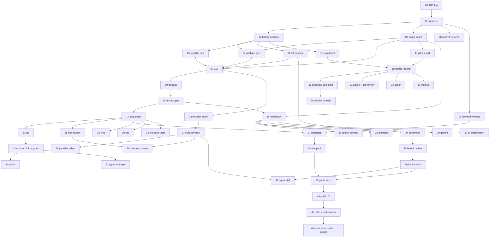

# Automated Code Review System — PR-level Implementation Plan

Executes the architect's build plan (`docs/design/build-plan.md`, reproduced in the originating
task) end to end. Unit of planning is the individual pull request.

## 1. Assumptions

- **Host language: TypeScript on Node 22 LTS, ESM only, `npm` workspaces (not pnpm), `tsc` build,
  `vitest` for the tool's own tests.** Rationale and the ranked alternatives are in Appendix A.
  Language-agnosticism is preserved not by the host language but by the analyzer port (PR-04):
  a subprocess contract (argv in, JSON findings on stdout) so a Python or Go analyzer is a config
  entry, not a fork.
- **Repo is 100% public-core.** `adamtait/reviewer` never contains org names, endpoint URLs,
  `AGENTS.md` content, or real rule patterns. Internal detail lives in the *destination* repo under
  `.review/`, produced at install time.
- **Naming and license:** `@adamtait/reviewer-core` (engine), `@adamtait/reviewer` (CLI,
  `bin: reviewer`), `@adamtait/reviewer-installer`, `@adamtait/reviewer-poller`; PLAN's
  `@team/review` is dropped. MIT, personal copyright; MIT requires no `NOTICE`, and per-file
  `// SPDX-License-Identifier: MIT` headers are enforced by `eslint-plugin-license-header`.
- **Decisions are recorded as ADRs** in `docs/adr/NNNN-slug.md`, MADR-lite, append-only: an
  Accepted ADR is never edited, only superseded. Each ADR lands in the PR that first implements
  its decision (PR-00 for the ones antecedent to any code). ADR markdown is excluded from a PR's
  diff budget, like lockfiles and fixtures, and quoted separately. Register: Appendix B.
- **Install path:** `npx @adamtait/reviewer init` detects the destination repo and writes
  `.review/config.yaml`, `.review/rules/`, `.github/workflows/review.yml`, and
  `.agent/skills/code-review/`. Idempotent, refuses overwrite without `--force`.
- **Six model access paths**, chosen at install: `openai-compatible`, `openai`, `gemini`,
  `anthropic`, `claude-code` (subscription, CLI subprocess), `codex` (subscription, CLI subprocess).
  Secrets always from env; provider *choice* from config.
- **Exit code is always 0** except on CLI misuse (2). Advisory posture is enforced in the process
  contract, not in the workflow YAML.
- **Third-party CLI tools** (gitleaks, opengrep, osv-scanner) are never npm dependencies and never
  vendored: resolved from `PATH`, version-pinned in config, spawned.
- **Fixture strategy:** `test/fixtures/tiny-ts-repo` (single package, deliberate boundary violation +
  floating promise + fake secret) and `test/fixtures/tiny-monorepo` (two workspaces). GitHub API
  responses are recorded JSON under `test/fixtures/github-api/`.
- **Releases:** semver tags, `npm publish --provenance` from a tag-triggered workflow. No changesets.

## 2. Deviations from PLAN §9

| Deviation | Reason |
|---|---|
| New Milestone 3 (installer, PR-23–26), absent from §9 | Required deliverable: adaptation to a destination repo is the product's front door, and it is what keeps internal config out of this repo. |
| Both PR triggers built (PR-21 Action, PR-22 poller), not Action-with-fallback | Chosen explicitly; removes §10.2 from the critical path entirely. |
| Four provider-adapter PRs (37–40) replace §5's single OpenAI-compatible client | Six access paths requested; `openai-compatible` preserves §5's `baseURL`+`apiKey` shape exactly as one sibling. |
| Commit hygiene + license inventory land in M0 (PR-08, PR-09), not a publication phase | Open-sourceability must be structural from PR #1; retrofitting SPDX headers and auditing history later is a rewrite. |
| `rdjson` reporter lands in phase 0 alongside `text` (PR-05) | Two formats prove the Reporter port is a port; costs ~40 lines. |
| Opengrep (PR-27) precedes Knip/OSV/type-coverage/changed-tests within phase 2 | Conventions-as-rules is §4's stated product; the other four are additive and independently revertable. |
| Secrets gate is PR-11, ordered *before* any `ModelProvider` type exists (PR-33) | §6 says week one; expressed as a topological guarantee rather than a calendar one. |
| Monorepo scoping (PR-26) sits in the installer, not phase 2 | Detection is an install-time concern; keeps the §10.6 unknown off the engine's critical path. |
| PR-00 (ADR log) added ahead of PR-01 | Decisions must be recorded with the code that implements them; the format and the append-only rule have to exist before the first ADR does. |
| 25 ADRs distributed across 20 existing PRs rather than one docs PR | An ADR written after the fact records a rationalisation, not a decision; landing it in the implementing PR makes the reviewer judge the decision and the code together. |
| PR-13a (shared TypeScript program cache) added to M1 | The concrete payoff of the Node host decision; without it, three analyzers each build their own TS program and PLAN §10.5 worsens. See Appendix A. |

**Conflicts named and resolved:** §1 ("model access injected via env, OpenAI-compatible") vs. the
six-provider requirement → multi-adapter port wins; env carries secrets only. §8.1
(`npx @team/review`, org-internal framing) vs. "personal project, MIT, no internal data" → the
personal/MIT framing wins; `@team` naming and the internal-endpoint default are removed from the
engine and become installer choices.

## 3. Repository layout

```
reviewer/                                   [public-core]  MIT; no internal data, ever
├── LICENSE  README.md  CONTRIBUTING.md  SECURITY.md  CHANGELOG.md   [public-core]
├── THIRD_PARTY_LICENSES.md                 [public-core]  inventory, CI-checked
├── action.yml                              [public-core]  composite GitHub Action
├── package.json  tsconfig.base.json  vitest.config.ts  eslint.config.js
├── .gitleaks.toml                          [public-core]  gate on THIS repo's history
├── .github/workflows/{ci.yml,self-review.yml,release.yml}           [public-core]
├── docs/{architecture.md,writing-rules.md,providers.md}             [public-core]
├── docs/adr/{README.md,template.md,NNNN-*.md}                      [public-core]  append-only
├── examples/
│   ├── config.minimal.yaml                 [public-core]  generic values only
│   └── rules/*.yaml                        [public-core]  generic demo rules only
├── packages/
│   ├── core/src/                           [public-core]  @adamtait/reviewer-core
│   │   ├── finding.ts  finding.schema.json
│   │   ├── config/{schema.ts,load.ts,resolve.ts}      <- the seam
│   │   ├── analyzer/{port.ts,registry.ts,subprocess.ts,sequencer.ts}
│   │   ├── ts/program.ts                              <- shared TS program cache
│   │   ├── analyzers/{gitleaks,tsc,eslint,dep-cruiser,opengrep,knip,osv,type-coverage,changed-tests}.ts
│   │   ├── diff/{scope.ts,hunks.ts}   gate/secrets-gate.ts   fingerprint.ts
│   │   ├── lane-b/{assemble.ts,review.ts,invalidate.ts,prompts/*.md}
│   │   ├── model/{port.ts,fake.ts,openai-compatible.ts,anthropic.ts,gemini.ts,cli-subscription.ts}
│   │   └── reporters/{port.ts,text.ts,rdjson.ts,github.ts,summary.ts}
│   ├── cli/                                [public-core]  @adamtait/reviewer (bin: reviewer)
│   ├── installer/                          [dual]  engine public; its output is destination-internal
│   │   ├── src/{detect.ts,plan.ts,write.ts,providers.ts,monorepo.ts}
│   │   └── templates/{config.yaml.hbs,review.yml.hbs,SKILL.md.hbs,review.sh.hbs,launchd.plist.hbs}
│   └── poller/                             [public-core]  local liveness surface
├── scripts/{check-licenses.mjs,check-adrs.mjs,audit-history.mjs}     [public-core]
└── test/fixtures/{tiny-ts-repo/,tiny-monorepo/,github-api/}         [public-core]
```

Generated into the destination repo, never present here — `.review/config.yaml`,
`.review/rules/*.yaml`, `.review/prompts/*.md`, `.review/type-coverage-baseline.json`,
`.github/workflows/review.yml`, `.agent/skills/code-review/` — all **[internal-only]**.

## 4. Milestone overview

| Milestone | PRs | PLAN phase | Demoable outcome | Exit criterion | Blocked by |
|---|---|---|---|---|---|
| M0 Foundation & seam | 00–09 | pre-0 | `reviewer --base main --reporter text` runs, reports zero findings | CI green; `check-adrs`, `check-licenses` and gitleaks-on-own-history pass | — |
| M1 Lane A deterministic | 10–15 incl. 13a | 0 | Local text review of a real PR finds a true boundary violation and a floating promise | Secrets gate provably blocks lane B; 5 analyzers diff-scoped | — |
| M2 GitHub surface | 16–22 | 1 | Inline advisory comments on a live PR, no duplicates across force-push | 10 PRs reviewed, zero duplicate comments | Actions availability (PR-21 only) |
| M3 Installer | 23–26 | new | `npx @adamtait/reviewer init` configures a fresh repo end to end | Fixture repo goes from clean to reviewing in one command | Nx answer (PR-26 only) |
| M4 Rules & full lane A | 27–32 | 2 | Three real team conventions fire automatically | Three most-repeated review comments now automated | — |
| M5 Lane B | 33–40 | 3 | Collapsed summary comment with evidence-bearing findings | Summary comment read, not collapsed-and-ignored; ≥1 provider live | Model terms (PR-37 enablement) |
| M6 Skill & measurement | 41–42 | 4–5 | Agent invokes review pre-PR; weekly acceptance table by `ruleId` | One rule deleted on evidence | M5 |
| M7 Publication | 43–46 | new | Public repo, `v0.1.0` on npm with provenance | `npm i @adamtait/reviewer` works from a clean machine | Provenance audit (PR-46) |

## 5. PR sequence

### M0 — Foundation & OSS seam

Everything that decides whether publishing is a copy or a rewrite lands here, before any behavior.

### PR-00 — Establish the ADR log and its append-only check

**Delivers:** `docs/adr/` with the process, template, index, an enforcement script, and the three decisions antecedent to any code — records ADR-0000, ADR-0001, ADR-0002.
**Depends on:** none.
**Touches:** `docs/adr/README.md`, `docs/adr/template.md`, `docs/adr/0000-record-architecture-decisions.md`, `docs/adr/0001-license-mit-with-spdx-headers.md`, `docs/adr/0002-implement-in-typescript-on-node.md`, `scripts/check-adrs.mjs`.
**Diff budget:** ~130 lines of script and index + 3 ADRs (~135 lines).
**OSS class:** public-core — the decision record is the first thing a public contributor reads, and must never carry internal detail.
**Reviewer's question:** is this the decision-record format, and is "supersede, never edit" the right immutability rule?
**Proof:** `node scripts/check-adrs.mjs` → `3 ADRs, index in sync, 0 violations`; edit the Decision section of an Accepted ADR and rerun → `ADR-0001: accepted ADR modified outside its status block`.
**Exit criterion:** the check fails on a duplicate number, a missing index entry, an invalid status, a one-way supersession link, and an edit to an Accepted ADR's body.
**Risk / rollback:** docs plus one script. **Paired with PR-01, which wires the check into CI — revert PR-01 first.**

### PR-01 — Bootstrap npm workspaces, MIT license, and CI

**Delivers:** empty-but-green monorepo: workspaces, strict tsconfig, vitest, ESLint with SPDX header rule, MIT `LICENSE`, `ci.yml` — which also runs PR-00's ADR check; implements ADR-0001 and ADR-0002.
**Depends on:** PR-00.
**Touches:** `package.json`, `tsconfig.base.json`, `vitest.config.ts`, `eslint.config.js`, `LICENSE`, `.gitignore`, `.github/workflows/ci.yml`, `packages/{core,cli}/package.json`.
**Diff budget:** ~430 lines. *Over budget: root toolchain config has no seam to split on — splitting it yields two PRs neither of which is green.*
**OSS class:** public-core — establishes license and header enforcement at the first commit.
**Reviewer's question:** is this the right toolchain and license posture to build 45 more PRs on?
**Proof:** `npm ci && npm run build && npm run lint && npm test` → all pass, "0 tests" acceptable.
**Exit criterion:** CI green on the branch; `npm run lint` fails if a `.ts` file lacks the SPDX header.
**Risk / rollback:** nothing depends on it yet; revert deletes the repo scaffolding.

### PR-02 — Add the Finding schema and its validator

**Delivers:** `Finding` type exactly per PLAN §2, a Zod validator, JSON Schema emitted from it, and a golden serialization test; records ADR-0003.
**Depends on:** PR-01.
**Touches:** `packages/core/src/finding.ts`, `finding.schema.json`, `test/finding.test.ts`, `test/__snapshots__/`, `docs/adr/0003-one-findings-schema.md`.
**Diff budget:** ~150 lines, plus 1 ADR (~45 lines, not counted).
**OSS class:** public-core — the contract every future contributor codes against.
**Reviewer's question:** is this shape sufficient for both lanes and all three reporters, and is `evidence` correctly required for `lane: 'llm'`?
**Proof:** `npm test -- finding` → golden snapshot matches; a lane-B finding without `evidence` fails validation.
**Exit criterion:** validator rejects all six malformed fixtures in the test.
**Risk / rollback:** revert is free; nothing imports it yet.

### PR-03 — Add config schema and resolution (the internal/public seam)

**Delivers:** `ReviewConfig` schema, `.review/config.yaml` loader, env overlay, and `resolveConfig()` — the only channel through which repo-specific values reach the engine; records ADR-0004.
**Depends on:** PR-01.
**Touches:** `packages/core/src/config/{schema.ts,load.ts,resolve.ts}`, `examples/config.minimal.yaml`, `test/config.test.ts`, `docs/adr/0004-repo-specific-values-behind-reviewconfig.md`.
**Diff budget:** ~320 lines, plus 1 ADR (~45 lines, not counted).
**OSS class:** public-core — the mechanism that keeps endpoints, org names, and rule paths out of the engine from PR-03 onward.
**Reviewer's question:** can any repo-specific value reach the engine except through `ReviewConfig`?
**Proof:** `npm test -- config` → loading `examples/config.minimal.yaml` yields a fully defaulted config; an unknown key fails with a path-qualified error.
**Exit criterion:** a grep test asserts no string literal matching `https?://` exists under `packages/core/src` outside tests.
**Risk / rollback:** self-contained; revert removes config loading.

### PR-04 — Define the Analyzer port, registry, and subprocess protocol

**Delivers:** `Analyzer` interface (`id`, `run(ctx): Promise<Finding[]>`), a registry, and `runSubprocessAnalyzer()` — argv in, JSON findings on stdout — so non-TypeScript analyzers are additive; records ADR-0005 and ADR-0006.
**Depends on:** PR-02, PR-03.
**Touches:** `packages/core/src/analyzer/{port.ts,registry.ts,subprocess.ts}`, `test/analyzer-port.test.ts`, `docs/architecture.md`, `docs/adr/0005-two-lane-analysis.md`, `docs/adr/0006-subprocess-analyzer-contract.md`.
**Diff budget:** ~250 lines, plus 2 ADRs (~90 lines, not counted).
**OSS class:** public-core — the extension seam for other languages.
**Reviewer's question:** can a third-party analyzer in any language satisfy this port without changing core?
**Proof:** `npm test -- analyzer-port` → a 12-line shell-script analyzer registered from a fixture produces a valid `Finding`.
**Exit criterion:** subprocess analyzer returning malformed JSON yields zero findings and one warning, never a throw.
**Risk / rollback:** revert removes extensibility; PR-05+ unaffected.

### PR-05 — Define the Reporter port with text and rdjson reporters

**Delivers:** `Reporter` interface plus two implementations — human-readable `text` and Reviewdog `rdjson`.
**Depends on:** PR-02.
**Touches:** `packages/core/src/reporters/{port.ts,text.ts,rdjson.ts}`, `test/reporters.test.ts`.
**Diff budget:** ~260 lines.
**OSS class:** public-core.
**Reviewer's question:** does the port carry enough context for a stateful reporter (GitHub) to be added later without widening it?
**Proof:** `npm test -- reporters` → both golden files match for the same 4-finding input.
**Exit criterion:** `rdjson` output validates against the Reviewdog diagnostic schema fixture.
**Risk / rollback:** independent; revert loses output formatting.

### PR-06 — Add diff scoping and the tiny-ts-repo fixture

**Delivers:** changed-file and changed-line-range extraction from `git diff --merge-base`, `filterToChangedLines()`, and the primary fixture repo; records ADR-0007.
**Depends on:** PR-02.
**Touches:** `packages/core/src/diff/{scope.ts,hunks.ts}`, `test/fixtures/tiny-ts-repo/**`, `test/diff.test.ts`, `docs/adr/0007-scope-analysis-to-changed-lines.md`.
**Diff budget:** ~300 lines excluding fixture, plus 1 ADR (~45 lines, not counted).
**OSS class:** public-core.
**Reviewer's question:** is hunk parsing correct for renames, deletions, and binary files?
**Proof:** `npm test -- diff` → fixture's two-commit history yields exactly 3 changed files and 11 changed lines; a finding on an untouched line is filtered out.
**Exit criterion:** rename-with-edit case asserted in tests.
**Risk / rollback:** independent; revert makes every analyzer whole-repo, which is why nothing ships before it.

### PR-07 — Wire the CLI entrypoint

**Delivers:** `reviewer` binary: `--base`, `--reporter`, `--staged`, `--pr <n>`, `--config`, `--only`, `--skip`; loads config, runs an empty registry, prints via reporter, exits 0; records ADR-0008 and ADR-0009.
**Depends on:** PR-03, PR-04, PR-05, PR-06.
**Touches:** `packages/cli/{package.json,bin/reviewer.mjs,src/main.ts,src/args.ts}`, `test/cli.test.ts`, `docs/adr/0008-cli-not-service.md`, `docs/adr/0009-never-block-a-pull-request.md`.
**Diff budget:** ~290 lines, plus 2 ADRs (~90 lines, not counted).
**OSS class:** public-core.
**Reviewer's question:** is the flag surface and the always-exit-0 advisory contract right?
**Proof:** `npm run build && (cd test/fixtures/tiny-ts-repo && node ../../../packages/cli/bin/reviewer.mjs --base main --reporter text)` → `reviewer: 0 analyzers registered, 0 findings`; `echo $?` → `0`.
**Exit criterion:** invalid flag exits 2 with usage; every other path exits 0.
**Risk / rollback:** revert removes the only entrypoint; M1 depends on it.

### PR-08 — Gate this repo's own history against secrets

**Delivers:** `.gitleaks.toml`, a `simple-git-hooks` pre-commit hook, and a CI job scanning full history; records ADR-0010.
**Depends on:** PR-01.
**Touches:** `.gitleaks.toml`, `package.json` (hooks), `.github/workflows/ci.yml`, CONTRIBUTING stub note, `docs/adr/0010-keep-internal-data-out-of-history.md`.
**Diff budget:** ~90 lines, plus 1 ADR (~45 lines, not counted).
**OSS class:** public-core — what must never enter history: API keys, internal hostnames, `.review/` files from any real repo, `AGENTS.md` copies.
**Reviewer's question:** does the allowlist admit the fixture's deliberate fake secret without admitting real ones?
**Proof:** `npx gitleaks detect --source . --config .gitleaks.toml --log-opts="--all"` → `no leaks found`; a commit containing `sk-ant-` is rejected locally.
**Exit criterion:** CI job fails on a branch that adds a synthetic AWS key outside the fixture allowlist.
**Risk / rollback:** revert removes the guard only.

### PR-09 — Add the third-party license inventory and its check

**Delivers:** `THIRD_PARTY_LICENSES.md`, `scripts/check-licenses.mjs` comparing it to `npm ls --json`, CI job, and a denylist that fails if any copyleft license appears as an npm dependency; records ADR-0011.
**Depends on:** PR-01.
**Touches:** `THIRD_PARTY_LICENSES.md`, `scripts/check-licenses.mjs`, `.github/workflows/ci.yml`, `docs/adr/0011-opengrep-as-separate-process.md`.
**Diff budget:** ~180 lines, plus 1 ADR (~45 lines, not counted).
**OSS class:** public-core — this is where the Opengrep LGPL-2.1 boundary is *enforced*, before the adapter exists (PR-27): Opengrep is listed as an external binary, and any npm dep with an LGPL/GPL/AGPL license fails the job.
**Reviewer's question:** does the denylist make an accidental copyleft link a CI failure rather than a legal review?
**Proof:** `node scripts/check-licenses.mjs` → `inventory matches N packages, 0 copyleft`; adding a GPL package to `devDependencies` fails it.
**Exit criterion:** drift in either direction (undocumented dep, or documented dep removed) fails CI.
**Risk / rollback:** revert removes the check; the inventory file stays accurate until the next dependency change.

### M1 — Lane A deterministic

The secrets gate lands before any type named `ModelProvider` exists anywhere in the tree.

### PR-10 — Add the gitleaks analyzer

**Delivers:** `analyzers/gitleaks.ts` — spawns gitleaks against changed files, parses JSON report, emits `secrets/*` findings at `high`/`error`.
**Depends on:** PR-07.
**Touches:** `packages/core/src/analyzers/gitleaks.ts`, `packages/cli/src/main.ts` (register), `test/analyzers/gitleaks.test.ts`.
**Diff budget:** ~190 lines.
**OSS class:** public-core.
**Reviewer's question:** does a missing gitleaks binary degrade to a warning rather than a crash — and is that the right default given PR-11 depends on it?
**Proof:** in `tiny-ts-repo`: `node .../reviewer.mjs --base main --reporter text` → one finding, `secrets/generic-api-key src/config.ts:4`.
**Exit criterion:** binary absent → exit 0, one stderr warning, `secretsScanUnavailable: true` in the run context.
**Risk / rollback:** revert leaves the gate (PR-11) with nothing to trigger on — revert both together.

### PR-11 — Add the secrets gate that blocks lane B

**Delivers:** `gate/secrets-gate.ts`: any `secrets/*` finding, or `secretsScanUnavailable`, sets `laneBBlocked` and hard-skips every lane-B-classified analyzer; records ADR-0012.
**Depends on:** PR-10.
**Touches:** `packages/core/src/gate/secrets-gate.ts`, `analyzer/registry.ts`, `test/gate/secrets-gate.test.ts`, `docs/adr/0012-abort-llm-lane-on-secret-detection.md`.
**Diff budget:** ~140 lines, plus 1 ADR (~45 lines, not counted).
**OSS class:** public-core — PLAN §6's one non-obvious safety property.
**Reviewer's question:** is it structurally impossible for a lane-B analyzer to run when the gate is set?
**Proof:** `npm test -- secrets-gate` → a spy lane-B analyzer registered in the test is invoked 0 times on the fixture, and 1 time when the fake secret is removed.
**Exit criterion:** test asserts fail-closed when the scanner could not run at all.
**Risk / rollback:** **paired with PR-10** — reverting either alone breaks the invariant; revert both.

### PR-12 — Add the pipeline sequencer with per-analyzer timeout and fail-open

**Delivers:** ordered execution per PLAN §3, per-analyzer timeout from config, fail-open with a warning, `--only`/`--skip` honoured, per-analyzer timing in `text` output; records ADR-0013.
**Depends on:** PR-11.
**Touches:** `packages/core/src/analyzer/sequencer.ts`, `config/schema.ts`, `test/sequencer.test.ts`, `docs/adr/0013-fixed-analyzer-order-fail-open.md`.
**Diff budget:** ~230 lines, plus 1 ADR (~45 lines, not counted).
**OSS class:** public-core.
**Reviewer's question:** is fail-open correct for every analyzer *except* the secrets scanner, and does the ordering match §3?
**Proof:** `node .../reviewer.mjs --base main --reporter text --skip tsc` → output lists analyzers in §3 order with ms timings, `tsc skipped`.
**Exit criterion:** an analyzer that hangs past its timeout is killed (process group, not just the child) and the run completes.
**Risk / rollback:** revert restores unordered parallel execution; analyzers still work.

### PR-13 — Add the tsc --noEmit analyzer

**Delivers:** runs the destination repo's own TypeScript, parses diagnostics, diff-scopes.
**Depends on:** PR-12.
**Touches:** `packages/core/src/analyzers/tsc.ts`, `test/analyzers/tsc.test.ts`.
**Diff budget:** ~160 lines.
**OSS class:** public-core.
**Reviewer's question:** is diagnostic parsing robust to project references and pretty output?
**Proof:** fixture with an injected type error → `types/TS2322 src/domain/order.ts:12`; removing it yields zero findings.
**Exit criterion:** uses the repo's local `typescript`, never a bundled copy.
**Risk / rollback:** fully additive.

### PR-13a — Add the shared TypeScript program cache

**Delivers:** `ts/program.ts` — builds one TypeScript program per `tsconfig` per run, memoized; PR-13 consumes it and PR-14/PR-31 consume it on landing; records ADR-0014.
**Depends on:** PR-13.
**Touches:** `packages/core/src/ts/program.ts`, `analyzers/tsc.ts`, `test/ts/program.test.ts`, `docs/adr/0014-share-one-typescript-program.md`.
**Diff budget:** ~180 lines, plus 1 ADR (~45 lines, not counted).
**OSS class:** public-core — the concrete payoff of the Node host decision (Appendix A); directly attacks PLAN §10.5.
**Reviewer's question:** is one program per `tsconfig` correct for a repo with project references or multiple workspaces?
**Proof:** `--only tsc,eslint,type-coverage` with `REVIEWER_TRACE=1` logs exactly one `createProgram` per tsconfig, not three.
**Exit criterion:** cache keyed on resolved tsconfig path + file-set hash; stale entries never reused across runs.
**Risk / rollback:** revert makes each analyzer build its own program — correct, slower.

### PR-14 — Add the type-aware typescript-eslint analyzer

**Delivers:** in-process ESLint run with the destination repo's flat config, restricted to the §3 rule set, reusing PR-13a's program, diff-scoped.
**Depends on:** PR-13a.
**Touches:** `packages/core/src/analyzers/eslint.ts`, `test/analyzers/eslint.test.ts`, `docs/architecture.md`.
**Diff budget:** ~280 lines.
**OSS class:** public-core.
**Reviewer's question:** is running the repo's own config (rather than shipping ours) the right call, and is the cold-start cost acceptable with the shared program?
**Proof:** fixture → `logic/no-floating-promises src/infra/http.ts:9`; `--only eslint` prints elapsed ms for the runtime budget conversation.
**Exit criterion:** repo with no ESLint config → skipped with a warning, exit 0.
**Risk / rollback:** additive; PLAN §10.5 is a runtime risk, not a correctness one — see §9.

### PR-15 — Add the dependency-cruiser analyzer

**Delivers:** programmatic dependency-cruiser run using the destination repo's `.dependency-cruiser.js`, findings mapped to `arch/*` rule IDs.
**Depends on:** PR-12.
**Touches:** `packages/core/src/analyzers/dep-cruiser.ts`, `test/analyzers/dep-cruiser.test.ts`, `test/fixtures/tiny-ts-repo/.dependency-cruiser.js`.
**Diff budget:** ~210 lines.
**OSS class:** public-core.
**Reviewer's question:** are cycles and orphans reported at the right file/line to be commentable?
**Proof:** fixture → `arch/no-domain-to-infra src/domain/order.ts:3` with the forbidden import on the reported line.
**Exit criterion:** whole-repo violations on files the PR did not touch are filtered out.
**Risk / rollback:** additive. **M1 exit: PLAN phase 0 satisfied.**

### M2 — GitHub surface

Dedupe exists before the first comment is ever posted.

### PR-16 — Add fingerprinting

**Delivers:** `sha256(ruleId + filePath + normalizedSnippet)`, snippet normalizer (whitespace, quotes, trailing commas), 6-hex short form for comment markers; records ADR-0015.
**Depends on:** PR-02.
**Touches:** `packages/core/src/fingerprint.ts`, `test/fingerprint.test.ts`, `docs/adr/0015-fingerprint-by-normalized-snippet.md`.
**Diff budget:** ~140 lines, plus 1 ADR (~45 lines, not counted).
**OSS class:** public-core.
**Reviewer's question:** does the fingerprint survive a line shift and a reindent but change when the logic changes?
**Proof:** `npm test -- fingerprint` → identical for the same snippet at lines 10 and 40; differs when an operator changes.
**Exit criterion:** three invariance cases and two sensitivity cases asserted.
**Risk / rollback:** independent.

### PR-17 — Add the GitHub client port and a read-only Octokit adapter

**Delivers:** `GitHubClient` interface plus `@octokit/rest` implementation for `listReviewComments`, `getPullRequest`, `listFiles`. No writes.
**Depends on:** PR-03.
**Touches:** `packages/core/src/github/{port.ts,octokit.ts}`, `test/github/octokit.test.ts`, `test/fixtures/github-api/*.json`.
**Diff budget:** ~240 lines.
**OSS class:** public-core.
**Reviewer's question:** is the port narrow enough that a reviewer can see exactly which GitHub scopes are needed?
**Proof:** `npm test -- octokit` → recorded fixtures replay; pagination over 2 pages of comments asserted.
**Exit criterion:** no write method exists in the port at this PR.
**Risk / rollback:** independent; read-only by construction.

### PR-18 — Add the GitHub reporter with fingerprint dedupe

**Delivers:** posts inline review comments for `confidence: high` only, embeds `<!-- rv:xxxxxx -->`, skips fingerprints already present, `--dry-run` prints the payload instead of posting; records ADR-0016 and ADR-0017.
**Depends on:** PR-16, PR-17.
**Touches:** `packages/core/src/reporters/github.ts`, `packages/core/src/github/{port.ts,octokit.ts}` (add `createReviewComment`), `packages/cli/src/args.ts`, `test/reporters/github.test.ts`, `docs/adr/0016-github-comments-as-the-store.md`, `docs/adr/0017-presentation-gated-on-confidence.md`.
**Diff budget:** ~420 lines. *Over budget: the write path, the dedupe query, and the dry-run switch are one behavior — splitting ships a reporter that posts duplicates.* Plus 2 ADRs (~90 lines).
**OSS class:** public-core.
**Reviewer's question:** is it impossible to post a duplicate, and impossible to post at all without `--reporter github`?
**Proof:** `node .../reviewer.mjs --pr 1 --reporter github --dry-run` → prints 2 comment bodies with markers; run against a real PR twice → second run reports `2 findings, 0 posted (deduped)`.
**Exit criterion:** `confidence: medium`/`low` findings are never posted inline by this reporter.
**Risk / rollback:** worst case is noisy comments on one PR; revert stops posting and leaves lane A intact.

### PR-19 — Add the collapsed summary comment

**Delivers:** one sticky `<details>` comment carrying all `medium`/`low` findings, upserted by a `<!-- rv:summary -->` marker.
**Depends on:** PR-18.
**Touches:** `packages/core/src/reporters/summary.ts`, `github/octokit.ts` (issue-comment upsert), `test/reporters/summary.test.ts`.
**Diff budget:** ~260 lines.
**OSS class:** public-core.
**Reviewer's question:** is the summary grouped and short enough that a human expands it?
**Proof:** `--reporter github --dry-run` on a fixture with 9 findings → one comment body, findings grouped by `ruleId`, collapsed by default; second run updates rather than appends.
**Exit criterion:** exactly one summary comment per PR regardless of run count.
**Risk / rollback:** additive to PR-18; revert loses medium/low reporting.

### PR-20 — Resolve stale threads behind an opt-in config flag

**Delivers:** GraphQL `resolveReviewThread` for fingerprints absent from the current run; default `resolveStaleThreads: false`.
**Depends on:** PR-19.
**Touches:** `packages/core/src/reporters/github.ts`, `github/octokit.ts`, `config/schema.ts`, `test/reporters/resolve.test.ts`.
**Diff budget:** ~210 lines.
**OSS class:** public-core.
**Reviewer's question:** is the opt-in default correct given this is the only action the bot takes on a human's thread?
**Proof:** `--dry-run` with the flag on → `would resolve thread rv:a3f9c2`; with it off → `0 resolutions`.
**Exit criterion:** only threads whose author is the token's own identity are ever resolved.
**Risk / rollback:** flag off restores prior behavior with no code change.

### PR-21 — Add the composite action and self-review workflow

**Delivers:** root `action.yml` (checkout depth, Node setup, tool install, `reviewer` invocation) and `.github/workflows/self-review.yml` dogfooding it on this repo; records ADR-0018.
**Depends on:** PR-18.
**Touches:** `action.yml`, `.github/workflows/self-review.yml`, `docs/architecture.md`, `docs/adr/0018-pull-request-trigger-not-target.md`.
**Diff budget:** ~150 lines, plus 1 ADR (~45 lines, not counted).
**OSS class:** public-core — consumers reference `adamtait/reviewer@v0`; no secrets in the action itself.
**Reviewer's question:** are the permissions minimal (`contents: read`, `pull-requests: write`) and is `pull_request` used rather than `pull_request_target`?
**Proof:** open a PR on this repo → the self-review job posts a lane A summary comment; a fork PR runs lane A and skips lane B.
**Exit criterion:** workflow green on a PR; no `pull_request_target` anywhere in the tree.
**Risk / rollback:** delete the workflow file; the action stays for consumers.

### PR-22 — Add the local poller surface

**Delivers:** `@adamtait/reviewer-poller` — polls Octokit `listPullRequests` on an interval, invokes the CLI with `--pr <n> --reporter github`, plus a `launchd` plist template; records ADR-0019.
**Depends on:** PR-18.
**Touches:** `packages/poller/**`, `packages/installer/templates/launchd.plist.hbs`, `test/poller.test.ts`, `docs/architecture.md`, `docs/adr/0019-ship-action-and-local-poller.md`.
**Diff budget:** ~300 lines, plus 1 ADR (~45 lines, not counted).
**OSS class:** public-core.
**Reviewer's question:** does the poller avoid re-reviewing unchanged PRs (`updatedAt` watermark persisted to disk)?
**Proof:** `node packages/poller/bin/poller.mjs --once --repo adamtait/reviewer --dry-run` → lists candidate PRs and the CLI commands it would run.
**Exit criterion:** a second `--once` run with no new pushes invokes the CLI zero times.
**Risk / rollback:** independent surface; revert removes it without touching the Action. **M2 exit: PLAN phase 1 satisfied.**

### M3 — Installer

This is the milestone that makes "no internal data in this repo" a mechanism rather than a promise.

### PR-23 — Add the installer skeleton with destination detection

**Delivers:** `reviewer init --dry-run`: detects package manager, workspaces/Nx, test runner, tsconfig layout, existing ESLint and dependency-cruiser config; prints an `InstallPlan`. Writes nothing; records ADR-0020.
**Depends on:** PR-07.
**Touches:** `packages/installer/src/{detect.ts,plan.ts}`, `packages/cli/src/main.ts` (subcommand), `test/installer/detect.test.ts`, `test/fixtures/tiny-monorepo/**`, `docs/adr/0020-adapt-at-install-time.md`.
**Diff budget:** ~340 lines, plus 1 ADR (~45 lines, not counted).
**OSS class:** dual — engine public; the plan it prints describes destination-internal files.
**Reviewer's question:** is `InstallPlan` the complete set of decisions install must make?
**Proof:** `(cd test/fixtures/tiny-monorepo && node ../../../packages/cli/bin/reviewer.mjs init --dry-run)` → plan naming 2 workspaces, `vitest`, 4 files to create, 0 to overwrite.
**Exit criterion:** `--dry-run` creates zero files, asserted by a post-run `git status --porcelain` check in the test.
**Risk / rollback:** read-only; revert is free.

### PR-24 — Add installer writers for config, rules directory, and workflow

**Delivers:** templated `.review/config.yaml`, `.review/rules/.gitkeep`, `.github/workflows/review.yml`; idempotent; refuses overwrite without `--force`.
**Depends on:** PR-23.
**Touches:** `packages/installer/src/write.ts`, `packages/installer/templates/{config.yaml.hbs,review.yml.hbs}`, `test/installer/write.test.ts`.
**Diff budget:** ~430 lines including templates. *Over budget: the templates are the deliverable; splitting writer from template ships a writer with nothing to write.*
**OSS class:** dual — templates are public and generic; rendered output is internal-only and lands outside this repo.
**Reviewer's question:** does the generated config contain only values detected from the destination repo — no defaults that encode anyone's architecture?
**Proof:** `cp -r test/fixtures/tiny-monorepo /tmp/dest && (cd /tmp/dest && node .../reviewer.mjs init)` → 3 files created; rerun → `0 created, 3 unchanged`.
**Exit criterion:** second `init` is a no-op; `init --force` rewrites and reports the diff.
**Risk / rollback:** revert leaves `--dry-run` working; generated files in destination repos are plain git-tracked files.

### PR-25 — Add provider selection to the installer

**Delivers:** interactive choice among the six access paths; writes the provider block plus `.env.example` naming required variables. Never writes a secret.
**Depends on:** PR-24.
**Touches:** `packages/installer/src/providers.ts`, `templates/config.yaml.hbs`, `docs/providers.md`, `test/installer/providers.test.ts`.
**Diff budget:** ~270 lines.
**OSS class:** public-core — the list of provider *kinds* is generic; chosen endpoints land only in the destination repo.
**Reviewer's question:** is it impossible for `init` to persist a credential to disk?
**Proof:** `node .../reviewer.mjs init --provider gemini --yes` in `/tmp/dest` → config has `provider: gemini`, `.env.example` names the key variable, and a grep for key prefixes under `/tmp/dest/.review` finds nothing.
**Exit criterion:** `lane_b.enabled: false` in every generated config regardless of provider — the flag is flipped by hand.
**Risk / rollback:** revert falls back to a config with no provider block; lane B stays off either way.

### PR-26 — Add monorepo scoping to the installer

**Delivers:** Nx and npm/pnpm/yarn workspace detection wiring `projects:` and an affected-project command into the generated config; engine honours it during diff scoping.
**Depends on:** PR-24, PR-15.
**Touches:** `packages/installer/src/monorepo.ts`, `packages/core/src/diff/scope.ts`, `config/schema.ts`, `test/installer/monorepo.test.ts`.
**Diff budget:** ~290 lines.
**OSS class:** dual.
**Reviewer's question:** does a single-package repo get exactly the same behavior as before this PR?
**Proof:** `init --dry-run` in `tiny-monorepo` → `projects: [pkg-a, pkg-b]`, and a PR touching only `pkg-a` runs analyzers against `pkg-a` only (asserted in the test).
**Exit criterion:** non-monorepo fixture output byte-identical to PR-24's.
**Risk / rollback:** revert reverts to whole-repo-with-diff-filter, which is correct but slower. **Blocked on the Nx answer (§8).**

### M4 — Rules and the remaining lane A

PLAN §4's claim — conventions are patterns, not prompts — becomes executable here.

### PR-27 — Add the Opengrep analyzer as a spawned binary

**Delivers:** `analyzers/opengrep.ts` — spawns `opengrep scan --json` with rules from config, parses to findings. No npm dependency, no vendoring, no linking.
**Depends on:** PR-12, PR-09.
**Touches:** `packages/core/src/analyzers/opengrep.ts`, `test/analyzers/opengrep.test.ts`, `THIRD_PARTY_LICENSES.md`, `docs/writing-rules.md`.
**Diff budget:** ~200 lines.
**OSS class:** public-core — LGPL-2.1 boundary preserved here and *enforced* by PR-09's copyleft denylist plus a test asserting no `opengrep` entry in any `package.json`.
**Reviewer's question:** is the process boundary the only coupling to Opengrep?
**Proof:** `npm test -- opengrep` → boundary test passes; a fixture with one rule → `conventions/no-raw-fetch-in-domain src/domain/order.ts:5`.
**Exit criterion:** `grep -r opengrep packages/*/package.json` returns nothing.
**Risk / rollback:** additive; missing binary degrades to a warning.

### PR-28 — Add the rule pack loader, generic example rules, and `rules test`

**Delivers:** `.review/rules/*.yaml` discovery, three generic example rules under `examples/rules/`, and `reviewer rules test` delegating to Opengrep's own rule-test mode.
**Depends on:** PR-27.
**Touches:** `packages/core/src/analyzers/opengrep.ts`, `examples/rules/*.yaml`, `packages/cli/src/main.ts`, `docs/writing-rules.md`, `test/rules.test.ts`.
**Diff budget:** ~320 lines.
**OSS class:** public-core — examples are deliberately generic (`no-raw-fetch-in-domain`, `no-console-in-lib`, `no-default-export-in-api`). Real rules encoding internal architecture live only in destination repos.
**Reviewer's question:** is writing a rule a five-minute job with the documented loop?
**Proof:** `node .../reviewer.mjs rules test --rules examples/rules` → `3 rules, 6 cases, 6 passed`.
**Exit criterion:** every example rule ships a passing positive and negative case.
**Risk / rollback:** revert removes examples and the test subcommand; the analyzer still loads rules from config.

### PR-29 — Add the Knip analyzer

**Delivers:** unused exports and dependencies, filtered to symbols the PR introduced or touched.
**Depends on:** PR-12.
**Touches:** `packages/core/src/analyzers/knip.ts`, `test/analyzers/knip.test.ts`.
**Diff budget:** ~180 lines.
**OSS class:** public-core.
**Reviewer's question:** is the diff filter tight enough that pre-existing dead code is never reported?
**Proof:** fixture adding an unused export → `dead/unused-export src/domain/order.ts:20`; pre-existing dead code in the same file → not reported.
**Exit criterion:** baseline run on unchanged fixture yields zero findings.
**Risk / rollback:** additive.

### PR-30 — Add the osv-scanner analyzer

**Delivers:** spawns `osv-scanner --format json` against the lockfile, reports only advisories introduced by the PR's lockfile delta.
**Depends on:** PR-12.
**Touches:** `packages/core/src/analyzers/osv.ts`, `test/analyzers/osv.test.ts`.
**Diff budget:** ~200 lines.
**OSS class:** public-core.
**Reviewer's question:** is "introduced by this PR" computed from the lockfile diff rather than the whole scan?
**Proof:** fixture PR adding a vulnerable pinned version → one `deps/*` finding; a PR touching no lockfile → zero findings and the scanner not spawned.
**Exit criterion:** unchanged lockfile short-circuits before spawning.
**Risk / rollback:** additive.

### PR-31 — Add the type-coverage ratchet

**Delivers:** runs type-coverage against PR-13a's shared program, compares to `.review/type-coverage-baseline.json`, reports only a decrease; `reviewer baseline --write` updates it.
**Depends on:** PR-13a.
**Touches:** `packages/core/src/analyzers/type-coverage.ts`, `packages/cli/src/main.ts`, `test/analyzers/type-coverage.test.ts`.
**Diff budget:** ~230 lines.
**OSS class:** public-core; the baseline file is destination-internal.
**Reviewer's question:** is a missing baseline treated as "record, don't report"?
**Proof:** `reviewer baseline --write` then a PR adding `any` → `types/coverage-regression 98.1% -> 97.4%`; no baseline → zero findings plus a hint.
**Exit criterion:** ratchet never reports an increase.
**Risk / rollback:** additive.

### PR-32 — Add the changed-tests analyzer

**Delivers:** detects `vitest`/`jest` from the destination repo and runs `--changed`/`--onlyChanged`, surfacing failures as findings.
**Depends on:** PR-12.
**Touches:** `packages/core/src/analyzers/changed-tests.ts`, `test/analyzers/changed-tests.test.ts`.
**Diff budget:** ~220 lines.
**OSS class:** public-core.
**Reviewer's question:** is a failing test reported at the assertion's file/line so it can be an inline comment?
**Proof:** fixture with a broken assertion → `tests/failing src/domain/order.test.ts:14` carrying the assertion message.
**Exit criterion:** no test runner detected → skipped with a warning. **M4 exit: PLAN phase 2 satisfied.**

### M5 — Lane B

The port and the fake provider land before any adapter can make a network call.

### PR-33 — Define the ModelProvider port with a fake provider and REVIEW_LLM=off

**Delivers:** `ModelProvider` interface (`complete(messages, {json}) -> string`), a deterministic `fake` provider for tests, and `REVIEW_LLM` defaulting to `off`; records ADR-0021.
**Depends on:** PR-11, PR-03.
**Touches:** `packages/core/src/model/{port.ts,fake.ts}`, `config/schema.ts`, `test/model/port.test.ts`, `docs/adr/0021-six-model-paths-one-provider-port.md`.
**Diff budget:** ~190 lines, plus 1 ADR (~45 lines, not counted).
**OSS class:** public-core — no endpoint, no model name, no org anywhere in the port.
**Reviewer's question:** does the port admit both HTTP APIs and subscription CLIs without leaking either into core?
**Proof:** `npm test -- model/port` → the fake provider satisfies the port; construction with `REVIEW_LLM=off` throws a typed `LaneBDisabled` that the sequencer treats as a skip.
**Exit criterion:** a test asserts the secrets gate short-circuits before any provider is constructed.
**Risk / rollback:** independent; nothing calls out yet.

### PR-34 — Add the lane B context assembler

**Delivers:** pure function building the model input: diff with N lines of hunk context, lane A findings, config-named guidance files loaded from HEAD, and a doc-staleness table (`*.md` mtime vs. referenced sources).
**Depends on:** PR-33, PR-06.
**Touches:** `packages/core/src/lane-b/assemble.ts`, `test/lane-b/assemble.test.ts`, `test/__snapshots__/assemble.txt`.
**Diff budget:** ~340 lines.
**OSS class:** public-core — guidance file *paths* come from config; no `AGENTS.md` content lives here.
**Reviewer's question:** is the assembled context deterministic and free of anything not named in config?
**Proof:** `npm test -- assemble` → golden snapshot byte-stable across runs; a repo with no guidance files produces a valid, smaller context.
**Exit criterion:** snapshot contains no absolute paths and no environment values.
**Risk / rollback:** pure function; revert is free.

### PR-35 — Add the lane B review pass with confidence capping

**Delivers:** prompt templates under `lane-b/prompts/` (overridable from `.review/prompts/`), JSON output validated against the findings schema, and a hard cap: `arch/missing-abstraction` and `quality/sloppy` never exceed `medium`; records ADR-0022.
**Depends on:** PR-34.
**Touches:** `packages/core/src/lane-b/review.ts`, `lane-b/prompts/*.md`, `test/lane-b/review.test.ts`, `docs/adr/0022-cap-taste-confidence-in-code.md`.
**Diff budget:** ~360 lines, plus 1 ADR (~45 lines, not counted).
**OSS class:** public-core — shipped prompts are generic; internal phrasing is a destination-repo override.
**Reviewer's question:** is the confidence cap enforced in code rather than requested in the prompt?
**Proof:** `npm test -- lane-b/review` → the fake provider returning `confidence: high` for a taste category is downgraded to `medium`; malformed JSON yields zero findings and one warning.
**Exit criterion:** taste-category findings can never reach the inline reporter.
**Risk / rollback:** `lane_b.enabled: false` disables it without a revert.

### PR-36 — Add the invalidation pass

**Delivers:** a second model call attempting to disprove each candidate; survivors keep `evidence`, the rest are dropped. `--no-invalidate` for debugging; records ADR-0023.
**Depends on:** PR-35.
**Touches:** `packages/core/src/lane-b/invalidate.ts`, `lane-b/prompts/invalidate.md`, `packages/cli/src/args.ts`, `test/lane-b/invalidate.test.ts`, `docs/adr/0023-disprove-before-emitting.md`.
**Diff budget:** ~290 lines, plus 1 ADR (~45 lines, not counted).
**OSS class:** public-core.
**Reviewer's question:** is a finding dropped when the disproof is merely plausible, or only when it is specific?
**Proof:** `npm test -- invalidate` → fake provider marking 2 of 3 candidates as intended behavior yields 1 finding carrying `evidence`; `--no-invalidate` yields 3 with no `evidence`.
**Exit criterion:** every emitted lane B finding has non-empty `evidence`.
**Risk / rollback:** `--no-invalidate` is the escape hatch; revert drops precision, not function.

### PR-37 — Add the openai-compatible provider adapter

**Delivers:** `baseURL` + `apiKey` + `model` from env, exactly PLAN §5's shape; covers the OpenAI API and any compatible endpoint.
**Depends on:** PR-33.
**Touches:** `packages/core/src/model/openai-compatible.ts`, `test/model/openai-compatible.test.ts`, `docs/providers.md`.
**Diff budget:** ~200 lines.
**OSS class:** public-core — no default `baseURL` compiled in; unset means lane B is skipped.
**Reviewer's question:** are timeouts, retries, and error redaction correct so a 401 never prints a key?
**Proof:** `npm test -- openai-compatible` → recorded-response fixture parses; a 401 fixture produces `provider error 401 (key redacted)` and exit 0.
**Exit criterion:** no network call when `REVIEW_MODEL_BASE_URL` is unset.
**Risk / rollback:** independent adapter; revert leaves the other three.

### PR-38 — Add the Anthropic provider adapter

**Delivers:** `@anthropic-ai/sdk` adapter behind the same port; model id from config, key from env.
**Depends on:** PR-33.
**Touches:** `packages/core/src/model/anthropic.ts`, `test/model/anthropic.test.ts`, `docs/providers.md`, `THIRD_PARTY_LICENSES.md`.
**Diff budget:** ~200 lines.
**OSS class:** public-core.
**Reviewer's question:** does structured JSON output come back schema-valid without prompt-level pleading?
**Proof:** `npm test -- model/anthropic` → recorded response yields a schema-valid findings array; missing key → `LaneBDisabled`, exit 0.
**Exit criterion:** no model id string hardcoded outside config defaults documented in `docs/providers.md`.
**Risk / rollback:** independent adapter.

### PR-39 — Add the Gemini provider adapter

**Delivers:** `@google/genai` adapter behind the same port.
**Depends on:** PR-33.
**Touches:** `packages/core/src/model/gemini.ts`, `test/model/gemini.test.ts`, `docs/providers.md`, `THIRD_PARTY_LICENSES.md`.
**Diff budget:** ~200 lines.
**OSS class:** public-core.
**Reviewer's question:** is response-schema handling equivalent in strictness to the other adapters?
**Proof:** `npm test -- model/gemini` → recorded response parses; a safety-blocked response yields zero findings and one warning.
**Exit criterion:** parity test suite shared with PR-37/38 passes for all three adapters.
**Risk / rollback:** independent adapter.

### PR-40 — Add the subscription CLI provider adapters

**Delivers:** `claude-code` and `codex` adapters spawning the local CLI in non-interactive JSON mode — one PR because the mechanism (subprocess, stdin prompt, JSON stdout, no key) is identical.
**Depends on:** PR-33.
**Touches:** `packages/core/src/model/cli-subscription.ts`, `test/model/cli-subscription.test.ts`, `docs/providers.md`.
**Diff budget:** ~280 lines.
**OSS class:** public-core.
**Reviewer's question:** is the subprocess boundary safe — no prompt content on argv, timeout enforced, non-zero exit fails open?
**Proof:** `npm test -- cli-subscription` → a stub script on `PATH` returns findings; prompt is delivered on stdin (asserted); a hanging stub is killed at the configured timeout.
**Exit criterion:** `ps`-visible argv never contains diff content.
**Risk / rollback:** independent adapters. **M5 exit: PLAN phase 3 satisfied.**

### M6 — Agent skill and measurement

### PR-41 — Add the agent skill template and installer wiring

**Delivers:** `SKILL.md` and `review.sh` templates; `init` writes them to the destination's `.agent/skills/code-review/`. SKILL.md specifies pre-push and pre-PR-open invocation and the lane A = facts / lane B = suggestions rule.
**Depends on:** PR-24, PR-36.
**Touches:** `packages/installer/templates/{SKILL.md.hbs,review.sh.hbs}`, `packages/installer/src/write.ts`, `test/installer/skill.test.ts`.
**Diff budget:** ~230 lines.
**OSS class:** dual — templates public, rendered skill internal-only.
**Reviewer's question:** does SKILL.md give an agent enough to decide *when* to invoke, not just how?
**Proof:** `init` in `/tmp/dest` → `.agent/skills/code-review/{SKILL.md,scripts/review.sh}`; `bash .agent/skills/code-review/scripts/review.sh --staged` prints a text report.
**Exit criterion:** the wrapper adds no flags the CLI does not document.
**Risk / rollback:** additive template; revert leaves the CLI usable directly.

### PR-42 — Add the acceptance-rate metrics command

**Delivers:** `reviewer metrics --since 7d` — queries review comments, parses `rv:` markers, groups by `ruleId` into resolved / outdated / open, emits markdown and CSV; records ADR-0024.
**Depends on:** PR-18.
**Touches:** `packages/cli/src/metrics.ts`, `packages/core/src/github/octokit.ts` (thread state), `test/metrics.test.ts`, `docs/adr/0024-measure-acceptance-per-rule.md`.
**Diff budget:** ~300 lines, plus 1 ADR (~45 lines, not counted).
**OSS class:** public-core.
**Reviewer's question:** is "acceptance" defined precisely enough to delete a rule on?
**Proof:** `node .../reviewer.mjs metrics --since 30d --repo adamtait/reviewer` → table with `ruleId | posted | resolved | outdated | acceptance%`.
**Exit criterion:** a rule with zero postings appears with `n/a`, not `0%`. **M6 exit: PLAN phases 4–5 satisfied.**

## 6. Dependency graph



**Critical path:** 00 → 01 → 02 → 04 → 07 → 10 → 11 → 12 → 13 → 13a → 14 → 16/18 → 33 → 34 → 35 → 36 → 43 → 44 → 45 → 46.

**Parallel:** 08/09 run alongside 02–07; 15, 29, 30 and 32 are mutually independent given 12; 37–40 are
four independent leaves off 33; 16/17 can proceed during M1; 23–25 need only 07.

## 7. Open-source readiness track

| Requirement | Established in | Enforced by |
|---|---|---|
| Decision record, append-only | PR-00 | `scripts/check-adrs.mjs` in CI (wired by PR-01); PR-46's history audit covers ADR provenance |
| License choice + copyright | PR-01 | `LICENSE`; `eslint-plugin-license-header` requires SPDX in every `.ts` (MIT needs no `NOTICE` — stated in README) |
| Engine/config separation | PR-03 | `resolveConfig()` as sole channel; test greps `packages/core/src` for URL literals |
| Language-extension seam | PR-04 | subprocess analyzer contract test |
| Nothing internal in history | PR-08 | `.gitleaks.toml` + pre-commit hook + full-history CI job |
| Third-party license inventory | PR-09 | `scripts/check-licenses.mjs` in CI; drift and copyleft-as-dependency both fail |
| Opengrep LGPL-2.1 boundary | PR-09, honoured PR-27 | copyleft denylist + boundary test asserting no `opengrep` npm entry |
| Generic examples only | PR-03, PR-28 | `examples/` reviewed as public surface; real rules live in destination `.review/` |
| Internal config never in this repo | PR-24 | installer writes only into the destination repo; `--dry-run` no-write test |
| No secrets written by tooling | PR-25 | `init` writes `.env.example` only; grep assertion in test |
| Fixture repo for tests | PR-06, PR-23 | `test/fixtures/{tiny-ts-repo,tiny-monorepo}`, no third-party code |
| Public CI | PR-01, hardened PR-44 | `ci.yml` matrix; self-review dogfooding in PR-21 |
| Versioning and release | PR-45 | tag-triggered `npm publish --provenance`; `CHANGELOG.md` |
| Publishable provenance | PR-46 | `scripts/audit-history.mjs` over every commit before the repo flips public |

**On the internal approval gate:** this is a personal MIT project, so no employer OSS-release review
applies. The substitute is PR-46's mechanical provenance audit. If employer-owned code or an internal
rule pattern ever lands here, that gate becomes a real review with multi-week lead time and must sit
immediately before PR-46; PR-43–45 are deliberately independent of it.

### PR-43 — Write README, CONTRIBUTING, and the example config

**Delivers:** `README.md`, `CONTRIBUTING.md` (dev loop, rule-writing, MIT contribution terms), `SECURITY.md`, issue/PR templates, and a fully-commented `examples/config.minimal.yaml`.
**Depends on:** PR-28, PR-36.
**Touches:** `README.md`, `CONTRIBUTING.md`, `SECURITY.md`, `.github/ISSUE_TEMPLATE/*`, `.github/pull_request_template.md`, `examples/config.minimal.yaml`.
**Diff budget:** ~380 lines.
**OSS class:** public-core.
**Reviewer's question:** can a stranger install, configure, and get a true finding using only these files?
**Proof:** follow README verbatim on a clean clone of `test/fixtures/tiny-ts-repo` → one true finding reported.
**Exit criterion:** no `@team`, org name, or internal URL anywhere in `docs/`, `README.md`, or `examples/`.
**Risk / rollback:** docs only.

### PR-44 — Harden public CI

**Delivers:** matrix over Node 22/24 and ubuntu/macos, third-party binary install steps pinned by version, cached `node_modules` and `tsbuildinfo`, required-check list.
**Depends on:** PR-43.
**Touches:** `.github/workflows/ci.yml`, `docs/architecture.md`.
**Diff budget:** ~170 lines.
**OSS class:** public-core.
**Reviewer's question:** does CI pass on a machine with none of gitleaks/opengrep/osv-scanner preinstalled?
**Proof:** CI green on all four matrix legs; `--only eslint` timing printed in the log to track PLAN §10.5.
**Exit criterion:** no analyzer test depends on a binary that CI does not install by pinned version.
**Risk / rollback:** revert to single-leg CI.

### PR-45 — Add release automation

**Delivers:** tag-triggered `release.yml` running build, test, `npm publish --provenance`; `CHANGELOG.md`; semver policy in `CONTRIBUTING.md`.
**Depends on:** PR-44.
**Touches:** `.github/workflows/release.yml`, `CHANGELOG.md`, `CONTRIBUTING.md`, `packages/*/package.json` (`files`, `publishConfig`).
**Diff budget:** ~200 lines.
**OSS class:** public-core.
**Reviewer's question:** does `npm pack` contain only `dist/`, templates, and license — no tests or fixtures?
**Proof:** `npm pack --workspaces --dry-run` → file lists contain no `test/`; a `v0.0.1-rc.1` tag on a scratch branch publishes successfully as a dry run.
**Exit criterion:** publishing requires a tag; no path publishes from `main`.
**Risk / rollback:** unpublish the RC; delete the workflow.

### PR-46 — Audit provenance, flip public, tag v0.1.0

**Delivers:** `scripts/audit-history.mjs` (scans every commit for internal-looking strings and non-MIT-compatible files), a CI job running it, and the `v0.1.0` tag.
**Depends on:** PR-45.
**Touches:** `scripts/audit-history.mjs`, `.github/workflows/ci.yml`, `CHANGELOG.md`.
**Diff budget:** ~190 lines.
**OSS class:** public-core.
**Reviewer's question:** does the audit prove no commit in history contains internal detail?
**Proof:** `node scripts/audit-history.mjs --all` → `N commits scanned, 0 findings`; after flipping visibility, `npm i @adamtait/reviewer` on a clean machine then `reviewer --help` works.
**Exit criterion:** audit clean across full history, and it runs on every future PR.
**Risk / rollback:** visibility is reversible; a published npm version is not — hence the audit gates the tag, not the other way round.

## 8. Day-one unblock list

| Question | Blocks | Who answers | Fallback if no |
|---|---|---|---|
| Are GitHub Actions enabled on the destination org, with `pull-requests: write` permitted for `GITHUB_TOKEN`? | PR-21 | Repo/org admin | PR-22's poller already ships; `init` selects the poller template instead of the workflow. |
| Do the terms covering each chosen credential permit automated, per-diff use — separately for Gemini, Anthropic, OpenAI, and the two subscription CLIs? | Enabling `lane_b.enabled: true` in CI, not any PR's code | You, against each provider's terms | Leave `lane_b.enabled: false` in CI and run lane B only on the agent surface (PR-41), where invocation is interactive. PR-33–40 are unaffected. |
| Does the provider-adapter contract in `adamtait/ra-plugins` differ from PR-33's port? (Not readable from the session that drafted this plan — repo scope was `adamtait/reviewer` only.) | PR-33 shape; PR-37–40 | You | Land PR-33 as specified; adapters are four independent leaves, so a contract change costs one PR each, not a redesign. |
| Do the destination repos use Nx, npm/pnpm/yarn workspaces, or neither? | PR-26 | You, from the destination repos | Ship PR-24 without `projects:`; whole-repo analysis with diff filtering is correct, just slower. |
| Is the npm scope `@adamtait` available and will packages publish publicly? | PR-45, PR-46 | You, on npmjs.com | Publish unscoped as `reviewer-cli`; only `package.json` names change. |
| Is any rule pattern or prompt you intend to write derived from employer-owned architecture docs? | PR-46 | You | Those artifacts stay in the destination repo's `.review/` and never enter this repo; the audit script's denylist gets the specific terms. |

## 9. Kill criteria

**Lane B taste categories (PR-35, PR-36).** Signal: after 30 days of postings with the metrics
command (PR-42) live, `arch/missing-abstraction` and `quality/sloppy` show acceptance below 30%, or
the summary comment goes unexpanded on more than 80% of PRs. Action: delete those two rule IDs from
the prompt and the cap table — one PR, ~40 lines. Do not tune the prompt a third time. Lane B keeps
the logic-bug and doc-aging categories, which are falsifiable.

**Opengrep rule pack (PR-27, PR-28).** Signal: three months after PR-28, fewer than three rules
exist, or any rule sits below 30% acceptance with no edit in 60 days. Action: delete the rule, and if
the count reaches zero, delete the analyzer — the LGPL boundary, the external binary dependency, and
the rule-authoring docs all go with it, and lane A loses nothing it was actually reporting.

**Type-aware ESLint runtime (PR-14).** Signal: `--only eslint` exceeds 8 minutes cold on a real
destination repo with PR-13a's shared program and PR-44's caching both in place, pushing total
latency past PLAN's 15-minute budget. Action: drop the type-aware rule subset to
`no-floating-promises` and `no-misused-promises` only; if that still misses, move the analyzer out of
the Action lane and run it only on the agent surface, where latency is not budgeted. Do not adopt
`oxlint-tsgolint` while it is alpha.

## Appendix A — Host language selection

PLAN is silent on the tool's own implementation language, and TypeScript is the *target* of review,
not necessarily the host. Candidates were scored against project-specific criteria:

| Weight | Criterion |
|---|---|
| 25% | TypeScript analyzer integration + warm-program reuse (`tsc`, typescript-eslint, type-coverage all build a TS program) |
| 20% | Single-engineer velocity across 46 PRs, part-time |
| 15% | Distribution to three surfaces (Action runner, agent skill, dev machine) |
| 15% | Extension seam + open-source contributor fit |
| 10% | Self-review / dogfooding (PR-21) |
| 10% | Model-provider and GitHub SDK maturity (four adapters; REST *and* GraphQL) |
| 5% | Subprocess and concurrency robustness (PR-12's sequencer) |

| Rank | Language | Score | Decisive fact |
|---|---|---|---|
| 1 | **TypeScript on Node 22** | 95 | Only option that can hold one TS program across three analyzers, and the only one that can review itself. |
| 1= | TypeScript on Bun (compiled) | 94 | Same benefits plus a single binary — but bets lane A on Bun's Node-API compat for full ESLint flat config and type-aware linting. A variant of #1, not a rival. |
| 3 | TypeScript on Deno | 83 | Good npm compat and a real permission model for a tool that spawns binaries; permission flags and the same ESLint compat risk cost it the top slot. |
| 4= | Go | 63 | Best distribution and the cleanest sequencer in the set; every TS analyzer becomes a cold subprocess. |
| 4= | Python 3.12 | 62 | Best SDK coverage and fastest prototyping; `uvx` makes distribution viable; dynamic typing fights the interfaces-before-implementations constraint. |
| 6 | Rust | 56 | Only ecosystem where a future in-process oxc/oxlint embed is possible, and WASM plugins are the best extension story of any candidate. Velocity cost too high for a part-time solo build; no official Anthropic SDK. |
| 7 | C# / .NET (NativeAOT) | 53 | Excellent typing and single-file output; zero ecosystem proximity to the thing being reviewed. |
| 8 | Kotlin / JVM | ~45 | JVM startup and distribution weight for no compensating advantage. |
| — | Ruby, Elixir, OCaml, Zig | dismissed | No analyzer or SDK proximity. (OCaml is Opengrep's own language; a one-person tooling project there has no leverage.) |

**Three arguments decide it.**

1. *Warm TypeScript program reuse is the only irreversible part of this choice.* All nine analyzers
   have JSON-emitting CLIs, so subprocess integration is equally easy from any host language —
   PR-04's port makes that language-agnostic by design. What is not language-agnostic: `tsc`,
   typescript-eslint's type-aware rules, and type-coverage all construct a TypeScript program over
   the same `tsconfig`. From Node you build it once (PR-13a) and hand it to all three; from Go, Rust
   or Python you build it three times on every PR — worsening exactly the risk PLAN §10.5 flags.
2. *Node is already installed on the surface that matters.* The destination repos are TypeScript, so
   their Actions workflow runs `setup-node` regardless. `npx @adamtait/reviewer` needs no download
   step, release asset, or checksum pinning. The static-binary advantage of Go and Rust largely
   evaporates here.
3. *Self-review is free in TypeScript and impossible otherwise.* PR-21 dogfoods the tool on its own
   PRs, exercising dependency-cruiser, typescript-eslint, tsc, Knip and type-coverage against code
   the author cares about. In Go, self-review exercises only gitleaks, Opengrep and osv-scanner.

Go's real wins, stated honestly: `os/exec` + `context` + goroutines makes PR-12's timeout-and-kill
sequencer about sixty robust lines where Node needs detached process groups; and a near-zero
dependency tree would make PR-09 trivial. Neither outweighs the three points above.

**Conditions attached to the decision.**

- PR-13a is mandatory, not optional. Without it, choosing Node buys nothing Go would not have given.
- Do not adopt Bun or Deno as the runtime. Keep Node as the supported runtime through M4; if
  distribution becomes a real complaint, add `bun build --compile` as an *additional* release
  artifact in PR-45, never as the runtime lane A depends on.
- The one signal that flips this to Rust: PLAN §10.5's kill criterion fires *and* PR-13a does not fix
  it. At that point the fix is a faster analyzer (oxc/oxlint-tsgolint), not a faster host — and if
  that has left alpha, Rust becomes the rational host because it can embed oxc in-process. That is a
  rewrite decision on evidence, not a hedge to take now.

## Appendix B — Architecture decision records

Decisions are immortalized in `docs/adr/`, one file per decision, MADR-lite, **append-only**: an
Accepted ADR is never edited, only superseded by a higher-numbered one. Each ADR lands in the PR that
first implements its decision, so a reviewer judges the rationale and the code in the same diff.
Decisions antecedent to any code land in PR-00.

### B.1 Register

| ADR | Decision | Rejected alternative, and what it would have cost | Lands in |
|---|---|---|---|
| 0000 | Record decisions as append-only ADRs, one per file, superseded never edited | A `DECISIONS.md` changelog — loses per-decision provenance and makes silent rewrites invisible | PR-00 |
| 0001 | License MIT, per-file SPDX headers, no `NOTICE` | Apache-2.0 — patent grant and NOTICE upkeep buy nothing for a personal project | PR-00 |
| 0002 | Implement in TypeScript on Node 22, npm workspaces | Go — three cold TypeScript programs per PR instead of one, no self-review (Appendix A) | PR-00 |
| 0003 | Normalize both lanes to one `Finding` schema; `evidence` required for `lane: 'llm'` | Per-analyzer output shapes — every reporter would need N adapters | PR-02 |
| 0004 | Route every repo-specific value through `ReviewConfig`, keeping this repo 100% public-core | An internal config package in-tree — publishing becomes sanitisation, not extraction | PR-03 |
| 0005 | Split analysis into a deterministic lane and an LLM lane, classified at registration | One lane with optional model calls — no way to guarantee the no-egress path | PR-04 |
| 0006 | Admit analyzers in any language over a subprocess JSON contract | In-process TypeScript plugins only — forecloses non-TS analyzers permanently | PR-04 |
| 0007 | Scope every analyzer to changed lines, mandatory, no opt-out | Whole-repo findings with severity filtering — trains reviewers to mute the bot | PR-06 |
| 0008 | Ship a CLI binary, not a service | A hosted webhook receiver — needs a host, auth, and an on-call rotation | PR-07 |
| 0009 | Never block a PR; always exit 0 except on CLI misuse | Configurable blocking — one false positive and the tool gets disabled org-wide | PR-07 |
| 0010 | Never admit internal data or secrets to this repo's history | Scrub before publishing — history rewriting is not reliably reversible | PR-08 |
| 0011 | Invoke Opengrep only as a separate process, never linked or vendored | An npm wrapper — LGPL-2.1 linkage obligations on an MIT codebase | PR-09 |
| 0012 | Abort the LLM lane entirely on any secret detection, and when the scanner could not run | Redact and continue — turns a leak into a leak plus exfiltration | PR-11 |
| 0013 | Run analyzers in a fixed cheap-first order, fail open, except the secrets scanner which fails closed | Parallel everything — loses fast feedback and the gate's ordering guarantee | PR-12 |
| 0014 | Build one TypeScript program per `tsconfig` per run and share it across TS analyzers | Per-analyzer programs — triples the dominant cost and worsens PLAN §10.5 | PR-13a |
| 0015 | Fingerprint on `sha256(ruleId + path + normalizedSnippet)`, never on line number | Line-based identity — every rebase re-posts every comment | PR-16 |
| 0016 | Use GitHub comments as the only persistence store, queried for dedupe | A local database — a host, a backup story, and a schema to migrate | PR-18 |
| 0017 | Gate presentation on `confidence`, not `severity`: only `high` goes inline | Severity-gated inline comments — high-severity guesses land in reviewers' faces | PR-18 |
| 0018 | Trigger on `pull_request`, never `pull_request_target` | `pull_request_target` — hands repo secrets to fork-authored code | PR-21 |
| 0019 | Ship both a GitHub Action and a local poller | Action only — an org policy change leaves the system with no trigger at all | PR-22 |
| 0020 | Adapt to the destination repo at install time, writing `.review/` there | Convention-over-configuration discovery — repo-specific values leak into the engine | PR-23 |
| 0021 | Six model access paths behind one `ModelProvider` port, chosen at install | One OpenAI-compatible client — excludes Gemini and the two subscription CLIs | PR-33 |
| 0022 | Cap taste-category confidence in code, at `medium`, not by prompt instruction | Asking the model to self-limit — unverifiable, and it drifts per prompt edit | PR-35 |
| 0023 | Disprove every LLM finding in a second pass before emitting it | Single-pass with a confidence score — the precision problem the whole lane lives or dies on | PR-36 |
| 0024 | Measure acceptance per `ruleId` from GitHub thread state and delete rules under ~30% | Manual judgement about which rules earn their keep — guessing exactly where it is most expensive | PR-42 |

### B.2 Template (`docs/adr/template.md`)

```markdown
# ADR-NNNN — <decision in the imperative>

- **Status:** Proposed | Accepted | Rejected | Superseded
- **Date:** YYYY-MM-DD
- **Implemented by:** PR-NN (or `—` for a decision with no single implementing PR)
- **Supersedes:** ADR-NNNN (or `—`)
- **Superseded by:** ADR-NNNN (or `—`)

## Context
The forces in play, including any constraint that is not ours to change.

## Decision
One paragraph, present tense, active voice.

## Consequences
- **Positive:** what this makes cheap or safe.
- **Negative:** what it makes expensive or forecloses — state it plainly.
- **Neutral:** what it commits us to without being better or worse.

## Alternatives rejected
- **<option>** — why not, in one or two sentences.

## Revisit when
The observable signal that would make this decision wrong. `—` if there is none.
```

`Revisit when` is the field that keeps the log honest: it is where PLAN §10's risks and this plan's
§9 kill criteria are attached to the decisions they would invalidate. ADR-0014's reads "type-aware
lint still exceeds 8 minutes cold with the shared program in place"; ADR-0022's and ADR-0023's point
at the acceptance-rate thresholds in §9.

### B.3 Enforcement (`scripts/check-adrs.mjs`, CI from PR-01)

The script fails the build on any of:

1. a duplicate or non-sequential ADR number, or a filename not matching `NNNN-kebab-slug.md`;
2. a missing or invalid `Status`, or a missing `Implemented by` line;
3. an ADR absent from `docs/adr/README.md`, or an index title that disagrees with the file's H1;
4. a one-way supersession — `Superseded by` without the reciprocal `Supersedes`, or either naming a
   nonexistent ADR;
5. **any content change to an Accepted ADR outside its status block**, computed as
   `git diff --merge-base origin/main -- docs/adr/`. This is the append-only rule; a decision that
   turned out wrong is superseded by a new ADR, never quietly rewritten.

Code that exists because of a decision cites it in a comment — `// ADR-0012: fail closed` on the
secrets gate, `// ADR-0007` on the diff filter. That convention is documented in ADR-0000 and left
unenforced; a lint rule for it would generate more noise than it catches.

### B.4 Relationship to PLAN

ADR-0005, ADR-0008, ADR-0009, ADR-0016 and ADR-0018 record decisions PLAN §1 and §8 already made;
their ADRs state PLAN as the context and do not reopen them. ADR-0002, ADR-0011, ADR-0020 and
ADR-0021 record decisions this plan made where PLAN was silent or where a stated requirement
overrode it — each names the conflict in its Context section, matching §2 of this document.
